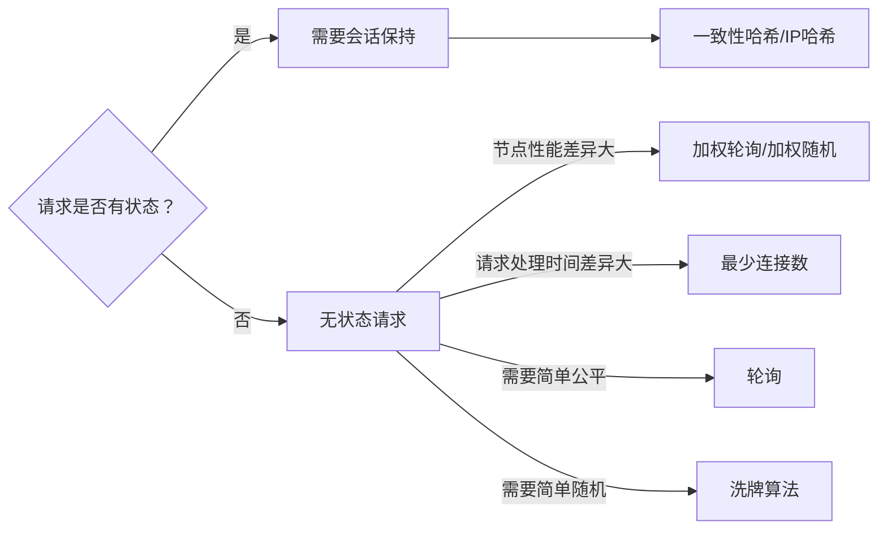

# 《Go语言高级编程》阅读笔记

一直以来看书学习什么的都是选择的入门书籍，一边复习基础知识一边了解细节，只有最后的几章会比较深入。感觉比起这种查漏补缺式的基础学习，我现在想要进一步提升的话更需要了解一些深入的知识，所以选择了本书。当然，也没要从头到尾完整啃一遍，毕竟很多东西学了暂时用不上没有实践巩固相当于白学。所以只读用得上和感兴趣的章节。

## 1. 语言基础

### 1.1 GO语言创世纪

go语言发展历程的历史介绍。主要介绍Go的并发特性是如何演变的。

### 1.2 Hello, World 的革命

带着代码进一步介绍各语言的演变。最后重点介绍Go语言的演变。

说实话，C和Go以外的语言都看不懂，但也不需要看懂，了解一下就行。

### 1.3 数组、字符串和切片

在Go中，数组、字符串和切片的底层内存结构是一致的，但上层具体实现各不相同，本章则深入底层进行详细讲解。

#### 1.3.1 数组

数组的长度是数组类型的组成部分。所以**不同长度**或不同类型的数据组成的数组都是不同的类型，无法直接赋值。所以Go中很少直接使用数组，而是更为灵活的切片。不过了解数组有助于我们进一步理解切片。

```go
var a [3]int                    // 定义长度为 3 的 int 型数组, 元素全部为 0
var b = [...]int{1, 2, 3}       // 定义长度为 3 的 int 型数组, 元素为 1, 2, 3
var c = [...]int{2: 3, 1: 2}    // 定义长度为 3 的 int 型数组, 元素为 0, 2, 3
var d = [...]int{1, 2, 4: 5, 6} // 定义长度为 6 的 int 型数组, 元素为 1, 2, 0, 0, 5, 6
```

如上是数组可选的定义方式，如下对各种方式进行解释。

1. 指定长度并将每个元素初始化为零值。
2. 定义时初始化全部元素，长度自动计算。
3. 按索引初始化指定元素，为指定元素初始化为零值，长度取决于最大索引。
4. 结合23，按索引从不同位置开始顺序初始化若干个元素。

>Go 语言中数组是**值语义**。一个数组变量即表示整个数组，它并**不是隐式的指向第一个元素的指针**（比如 C 语言的数组），而是一个完整的值。

这里提到可以使用空数组避免占用内存空间，例如`[0]int`。不过更常见的做法还是使用`struct{}{}`。

#### 1.3.2 字符串

一个字符串是一个**不可改变**的字节序列，通常是用来包含人类可读的文本数据。和数组不同的是，字符串的元素不可修改，是一个只读的字节数组。

Go 语言字符串的底层结构在 `reflect.StringHeader` 中定义：

```go
type StringHeader struct {
    Data uintptr
    Len  int
}
```

字符串结构由两个信息组成：第一个是字符串指向的底层字节数组，第二个是字符串的字节的长度。字符串其实是一个结构体，因此字符串的赋值操作也就是 `reflect.StringHeader` 结构体的复制过程，并不会涉及底层字节数组的复制。

Go 语言对字符串和 `[]rune` 类型的相互转换提供了特殊的支持。`rune` 用于表示每个 `Unicode` 码点 只是 `int32` 类型的别名，并不是重新定义的类型。

最后提供了 `string`, `[]byte`, `[]rune` 各种类型的模拟转换方式，想深入底层进一步了解可以看看。

#### 1.3.3 切片(slice)

我们先看看切片的结构定义，`reflect.SliceHeader`：

```go
type SliceHeader struct {
    Data uintptr
    Len  int
    Cap  int
}
```

相比数组，切片多了一个 Cap 成员表示切片指向的内存空间的最大容量（对应元素的个数，而不是字节数）。

和数组的最大不同是，切片的类型和长度信息无关，只要是相同类型元素构成的切片均对应相同的切片类型。

**添加切片元素**：

内置的泛型函数 append 可以在切片的尾部追加 N 个元素。

在容量不足的情况下，append 的操作会导致重新分配内存，可能导致巨大的内存分配和复制数据代价。即使容量足够，依然需要用 append 函数的返回值来更新切片本身，因为新切片的长度已经发生了变化。

除了在切片的尾部追加，我们还可以在切片的开头添加元素，但一般都会导致内存的重新分配，而且会导致已有的元素全部复制 1 次，所以性能会差很多。

可以用 `copy` 和 `append` 组合可以避免创建中间的临时切片：

```go
// 添加到末尾
a = append(a, 0)     // 切片扩展 1 个空间
copy(a[i+1:], a[i:]) // a[i:] 向后移动 1 个位置
a[i] = x             // 设置新添加的元素

// 添加到中间
a = append(a, x...)       // 为 x 切片扩展足够的空间
copy(a[i+len(x):], a[i:]) // a[i:] 向后移动 len(x) 个位置
copy(a[i:], x)            // 复制新添加的切片
```

**删除切片元素**：

删除操作也可以用 `copy` 或者 `append` 避免移动数据指针。如果有C语言基础的话比较容易理解，和C的数组操作类似。

```go
// 从尾部删除
a = []int{1, 2, 3}
a = a[:len(a)-1]   // 删除尾部 1 个元素
a = a[:len(a)-N]   // 删除尾部 N 个元素

// 从头部删除
a = []int{1, 2, 3}
a = a[1:] // 删除开头 1 个元素
a = a[N:] // 删除开头 N 个元素

a = append(a[:0], a[1:]...) // 删除开头 1 个元素
a = append(a[:0], a[N:]...) // 删除开头 N 个元素

a = a[:copy(a, a[1:])] // 删除开头 1 个元素
a = a[:copy(a, a[N:])] // 删除开头 N 个元素

// 从中间删除
a = []int{1, 2, 3, ...}

a = append(a[:i], a[i+1:]...) // 删除中间 1 个元素
a = append(a[:i], a[i+N:]...) // 删除中间 N 个元素

a = a[:i+copy(a[i:], a[i+1:])]  // 删除中间 1 个元素
a = a[:i+copy(a[i:], a[i+N:])]  // 删除中间 N 个元素
```

**切片内存技巧**：

在判断一个切片是否为空时，一般通过 len 获取切片的长度来判断，而不是直接和nil比较。

在原切片上声明0长切片可以直接服用原切片的内存和容量，减少内存分配，提高性能。

```go
// e.g. 根据条件过滤
func Filter(s []byte, fn func(x byte) bool) []byte {
    b := s[:0]
    for _, x := range s {
        if !fn(x) {
            b = append(b, x)
        }
    }
    return b
}
```

**避免切片内存泄漏**：

这里给出了两个例子，一个是切片引用了原始数组导致GC无法回收，解决方法是复制数据到新切片返回：

```go
// 错误：直接返回引用了文件的切片
func FindPhoneNumber(filename string) []byte {
    b, _ := ioutil.ReadFile(filename)
    return regexp.MustCompile("[0-9]+").Find(b)
}

// 正确：复制到新切片
func FindPhoneNumber(filename string) []byte {
    b, _ := ioutil.ReadFile(filename)
    b = regexp.MustCompile("[0-9]+").Find(b)
    return append([]byte{}, b...)
}
```

另一个例子是对于指针切片，删除一个元素后被删除的元素依然被切片引用，其内存不会被GC回收：

```go
// 错误
var a []*int{ ... }
a = a[:len(a)-1]    // 被删除的最后一个元素依然被引用, 可能导致 GC 操作被阻碍

// 正确
var a []*int{ ... }
a[len(a)-1] = nil // GC 回收最后一个元素内存
a = a[:len(a)-1]  // 从切片删除最后一个元素

```

如果切片生命周期很短，不用刻意处理这个问题。GC回收切片时会回收所有元素。

**切片类型强制转换**:

为了安全，当两个切片类型 []T 和 []Y 的底层原始切片类型不同时，Go 语言是无法直接转换类型的。不过也可以通过`unsafe`和`reflect`等包进行更底层的操作，这时的语法就更像C了。

示例略，有需要再看。需要一定的前置知识，而`reflect`和`unsafe`包我都只有简单了解，平时基本用不上。

### 1.4 函数、方法和接口

**init初始化顺序**：

- 不同包：按导入顺序
- 同一包不同文件：顺序不确定
- 同一文件：按出现顺序

[包初始化流程](https://chai2010.cn/advanced-go-programming-book/images/ch1-11-init.ditaa.png)

#### 1.4.1 函数

在 Go 语言中，函数是一类对象，可以保存变量中。函数主要有具名和匿名之分。

Go 语言中的函数可以有多个参数和多个返回值，还支持可变数量的参数，相当于切片类型。

---

当匿名函数捕获了外部外部作用域的局部变量时，我们称其为**闭包**。

闭包对捕获的外部变量并不是传值方式访问，而是以**引用**的方式访问,使得这些变量的生命周期可以超出它们所在的作用域，只要还有引用它们的闭包存在。

闭包的这种引用方式访问外部变量的行为可能会导致一些隐含的问题:

```go
func main() {
    for i := 0; i < 3; i++ {
        defer func(){ println(i) } ()
    }
}
// Output:
// 3
// 3
// 3
```

修复的思路是在每轮迭代中为每个 defer 函数生成独有的变量。可以复制一份或者通过参数传入。

```go
func main() {
    for i := 0; i < 3; i++ {
        i := i // 定义一个循环体内局部变量 i
        defer func(){ println(i) } ()
    }
}

func main() {
    for i := 0; i < 3; i++ {
        // 通过函数传入 i
        // defer 语句会马上对调用参数求值
        defer func(i int){ println(i) } (i)
    }
}
```

---

Go 语言中，以切片为参数调用函数时，有时看起来像是传引用而非传值。虽然切片的底层数组确实是通过隐式指针传递(指针传值，但指向同一份数据)，但切片结构体中还包括len和cap信息是传值的，发生变动时不能反映到原切片。所以一般会通过返回修改后的切片来更新原切片，例如内置函数`append()`。

#### 1.4.2 方法

方法一般是面向对象编程(OOP)的一个特性，在 C++ 语言中方法对应一个类对象的成员函数，是关联到具体对象上的虚表中的。但是 Go 语言的方法却是关联到类型的，这样可以在编译阶段完成方法的静态绑定。

Go 语言中，通过在结构体内置匿名的成员来实现继承。通过嵌入匿名的成员，可以继承其内部成员及匿名成员类型所对应的方法。

```go
type Cache struct {
    m map[string]string
    sync.Mutex
}

func (p *Cache) Lookup(key string) string {
    p.Lock()            // 编译时展开为p.Mutex.Lock()
    defer p.Unlock()    // 同上

    return p.m[key]
}
```

这种方式继承的方法是编译时静态绑定的，并不能实现 C++ 中虚函数的多态特性。所有继承来的方法的接收者参数依然是那个匿名成员本身，而不是当前的变量。如果需要虚函数的多态特性，需要借助 Go 语言接口来实现。

#### 1.4.3 接口

接口这一节讲的比较玄乎，个人理解是只要类型实现了接口定义的方法声明，就算实现了这个接口，不需要显示声明。当然，要真正理解还是需要多加练习。

Go 语言对基础类型的类型一致性要求非常严格，但对于接口类型的转换则非常的灵活。对象和接口之间的转换、接口和接口之间的转换都可能是隐式的转换。

```go
var (
    a io.ReadCloser = (*os.File)(f) // 隐式转换, *os.File 满足 io.ReadCloser 接口
    b io.Reader     = a             // 隐式转换, io.ReadCloser 满足 io.Reader 接口
    c io.Closer     = a             // 隐式转换, io.ReadCloser 满足 io.Closer 接口
    d io.Reader     = c.(io.Reader) // 显式转换, io.Closer 不满足 io.Reader 接口
)
```

有时候对象和接口之间太灵活了，导致我们需要人为地限制这种无意之间的适配。常见的做法是定义一个含特殊方法来区分接口。

```go
type runtime.Error interface {
    error

    // RuntimeError is a no-op function but
    // serves to distinguish types that are run time
    // errors from ordinary errors: a type is a
    // run time error if it has a RuntimeError method.
    RuntimeError()
}

type proto.Message interface {
    Reset()
    String() string
    ProtoMessage()
}
```

不过这种限制也可以被手动实现对应方法或者嵌入匿名的原接口来绕过。

这种通过嵌入匿名接口或嵌入匿名指针对象来实现继承的做法其实是一种纯**虚继承**，我们继承的只是接口指定的规范，真正的实现在运行的时候才被注入。

### 1.5 面向并发的内存模型

#### 1.5.1 Goroutine和系统线程

Goroutine 是 Go 语言特有的并发体，是一种轻量级的线程，由 go 关键字启动。goroutine 和系统线程并不等价，前者开销更小。

系统级线程的栈大小固定（一般默认可能是 2MB），用来保存函数递归调用时参数和局部变量。固定了栈的大小导致了两个问题：

- 对于很多只需要很小的栈空间的线程：
    问题：浪费空间
    解决：降低固定的栈大小，提升空间的利用率
- 对于少数需要巨大栈空间的线程：
    问题：存在栈溢出风险
    解决：增大栈的大小以允许更深的函数递归调用

很明显，两者是无法兼得的。

Goroutine 的栈大小是动态变化的，启动时很小（可能是2KB 或 4KB）当遇到深度递归导致当前栈空间不足时，Goroutine 会根据需要动态地伸缩栈的大小。也因为启动的代价很小，可以轻易启动大量 Goroutine。

关于go的调度器，这里简单提了一下，有机会我再深入了解。

#### 1.5.2 原子操作

所谓的原子操作就是并发编程中“最小的且不可并行化”的操作。数据库四原则ACID中的A就是指的原子性（atomic）。

对粗粒度下的原子操作可以使用`sync.Mutex`的互斥锁保证并发安全。不过`sync.Mutex`常用于整个代码块的复杂逻辑。对于单个数值的原子操作，可以使用性能更高的`sync/atomic`包。

```go
import (
    "sync"
    "sync/atomic"
)

var total uint64

func worker(wg *sync.WaitGroup) {
    defer wg.Done()

    var i uint64
    for i = 0; i <= 100; i++ {
        atomic.AddUint64(&total, i)
    }
}

func main() {
    var wg sync.WaitGroup
    wg.Add(2)

    go worker(&wg)
    go worker(&wg)
    wg.Wait()
}
```

也可以组合原子操作和互斥锁实现高效的单件模式，通过原子检测标志位状态降低互斥锁的使用次数来提高性能。例如标准库的`sync.Once`实现：

```go
type Once struct {
    m    Mutex
    done uint32
}

func (o *Once) Do(f func()) {
    if atomic.LoadUint32(&o.done) == 1 {
        return
    }

    o.m.Lock()
    defer o.m.Unlock()

    if o.done == 0 {
        defer atomic.StoreUint32(&o.done, 1)
        f()
    }
}
```

使用例：

```go
var (
    instance *singleton
    once     sync.Once
)

func Instance() *singleton {
    once.Do(func() {
        instance = &singleton{}
    })
    return instance
}
```

对于复杂对象的原子操作，可以使用`sync/atomic`的`Load`和`Store`方法，其参数和返回值都是`interface{}`。

一个简化的生产者消费者模型使用例：

```go
var config atomic.Value // 保存当前配置信息

// 初始化配置信息
config.Store(loadConfig())

// 启动一个后台线程, 加载更新后的配置信息
go func() {
    for {
        time.Sleep(time.Second)
        config.Store(loadConfig())
    }
}()

// 用于处理请求的工作者线程始终采用最新的配置信息
for i := 0; i < 10; i++ {
    go func() {
        for r := range requests() {
            c := config.Load()
            // ...
        }
    }()
}
```

#### 1.5.3 顺序一致性内存模型

大意就是不同Goroutine之间的执行顺序不确定，有需要时需要使用同步原语明确排序。

#### 1.5.4 初始化顺序

在 [函数](#141-函数) 章节已经介绍过初始化顺序。在 `main.main` 函数执行之前所有代码都运行在同一个 `Goroutine` 中，即运行在程序的主系统线程中。所以所有的 `init` 函数和 `main` 函数都是在主线程完成，它们也是满足顺序一致性模型的。但是 `init` 函数中开启的新 `goroutine` 就并非如此了。

#### 1.5.5 Goroutine的创建

`go` 语句会在当前 Goroutine 对应函数返回前创建新的 Goroutine。但是新创建 Goroutine 对应的 `f()` 的执行事件和 原 Goroutine 返回的事件则是不可排序的，也就是并发的。

#### 1.5.6 基于 Channel 的通信

基本就是一些 Channel 基础用法。

- **对于从无缓冲 Channel 进行的接收，发生在对该 Channel 进行的发送完成之前。**
- **对于 Channel 的第 K 个接收完成操作发生在第 K+C 个发送操作完成之前，其中 C 是 Channel 的缓存大小。**

可以通过控制 Channel 的缓存大小来控制并发执行的 Goroutine 的最大数目。

#### 1.5.7 不靠谱的同步

```go
func main() {
    go println("hello, world")
    time.Sleep(time.Second)
}
```

如上，有时我们会简单通过休眠来保证执行顺序，但这种做法并不严谨。最好使用显式的同步操作。

### 1.6 常见的并发模式

Go 语言的并发编程哲学：

> Do not communicate by sharing memory; instead, share memory by communicating.
> 不要通过共享内存来通信，而应通过通信来共享内存。

#### 1.6.1 并发版本的 Hello world

从`sync.Mutex`到 Channel 缓冲区大小等方面，由浅入深介绍并发条件下如何控制执行顺序，最后引出`sync.WaitGroup`的大致原理和用法。

```go
func main() {
    done := make(chan int, 10) // 带 10 个缓存

    // 开 N 个后台打印线程
    for i := 0; i < cap(done); i++ {
        go func(){
            fmt.Println("你好, 世界")
            done <- 1
        }()
    }

    // 等待 N 个后台线程完成
    for i := 0; i < cap(done); i++ {
        <-done
    }
}
```

如上只是方便理解，实际`sync.WaitGroup`维护的是一个计数器而非通道。不过用法是一致的。

```go
func main() {
    var wg sync.WaitGroup

    // 开 N 个后台打印线程
    for i := 0; i < 10; i++ {
        wg.Add(1)

        go func() {
            fmt.Println("你好, 世界")
            wg.Done()
        }()
    }

    // 等待 N 个后台线程完成
    wg.Wait()
}
```

#### 1.6.2 生产者消费者模型

> 并发编程中最常见的例子就是生产者消费者模式，生产者生产数据放到成果队列中，同时消费者从成果队列中来取这些数据。这样就让生产消费变成了异步的两个过程。

```go
// 生产者: 生成 factor 整数倍的序列
func Producer(factor int, out chan<- int) {
    for i := 0; ; i++ {
        out <- i*factor
    }
}

// 消费者
func Consumer(in <-chan int) {
    for v := range in {
        fmt.Println(v)
    }
}
func main() {
    ch := make(chan int, 64) // 成果队列

    go Producer(3, ch) // 生成 3 的倍数的序列
    go Producer(5, ch) // 生成 5 的倍数的序列
    go Consumer(ch)    // 消费生成的队列

    // Ctrl+C 退出
    sig := make(chan os.Signal, 1)
    signal.Notify(sig, syscall.SIGINT, syscall.SIGTERM)
    fmt.Printf("quit (%v)\n", <-sig)
}
```

#### 1.6.3 发布订阅模型

> 发布订阅（publish-and-subscribe）模型通常被简写为 pub/sub 模型。在这个模型中，消息生产者成为发布者（publisher），而消息消费者则成为订阅者（subscriber），生产者和消费者是 M:N 的关系。在传统生产者和消费者模型中，是将消息发送到一个队列中，而发布订阅模型则是将消息发布给一个主题。

示例代码怪怪的，订阅者只能订阅一个发布者的一个主题。干脆自己手搓一个示例：[Jinvic/pubsub 发布订阅模型示例](https://github.com/Jinvic/pubsub)。

#### 1.6.4 控制并发数

介绍虚拟文件系统`vfs`包有一个`gatefs`子包会通过一个带缓存的通道控制访问该虚拟文件系统的访问并发数。不只是这个包，我们在其他功能中需要控制并发数时也可以参考这个实现。

```go
import (
    "golang.org/x/tools/godoc/vfs"
    "golang.org/x/tools/godoc/vfs/gatefs"
)

func main() {
    fs := gatefs.New(vfs.OS("/path"), make(chan bool, 8))
    // ...
}
```

```go
var limit = make(chan int, 3)

func main() {
    for _, w := range work {
        go func() {
            limit <- 1
            w()
            <-limit
        }()
    }
    select{}
}
```

#### 1.6.5 赢者为王

简单来说就是并行运行多个任务，消费最先完成的任务返回的结果（First-Win）。原文示例简化了**资源清理**和**取消机制**，让AI重写补了一下。

```go
package main

import (
    "context"
    "fmt"
    "math/rand"
    "time"
)

// 模拟不同搜索引擎的搜索函数
// 它们接收一个 context.Context，当 context 被取消时，应该停止工作
func searchByBing(ctx context.Context, query string) (string, error) {
    // 模拟随机的网络延迟 (100ms - 1000ms)
    delay := time.Duration(100+rand.Intn(900)) * time.Millisecond
    timer := time.NewTimer(delay)
    defer timer.Stop() // 防止资源泄漏

    select {
    case <-timer.C:
        // 模拟成功返回结果
        return fmt.Sprintf("[Bing] Results for '%s' (took %v)", query, delay), nil
    case <-ctx.Done():
        // context 被取消了，立即返回
        return "", ctx.Err() // 返回错误，通常是 context.Canceled
    }
}

func searchByGoogle(ctx context.Context, query string) (string, error) {
    delay := time.Duration(50+rand.Intn(1500)) * time.Millisecond
    timer := time.NewTimer(delay)
    defer timer.Stop()

    select {
    case <-timer.C:
        return fmt.Sprintf("[Google] Results for '%s' (took %v)", query, delay), nil
    case <-ctx.Done():
        return "", ctx.Err()
    }
}

func searchByBaidu(ctx context.Context, query string) (string, error) {
    delay := time.Duration(200+rand.Intn(2000)) * time.Millisecond
    timer := time.NewTimer(delay)
    defer timer.Stop()

    select {
    case <-timer.C:
        return fmt.Sprintf("[Baidu] Results for '%s' (took %v)", query, delay), nil
    case <-ctx.Done():
        return "", ctx.Err()
    }
}

// 并发搜索：启动多个搜索引擎，返回第一个成功的结果
func parallelSearch(query string) (string, error) {
    // 1. 创建一个可取消的 context
    ctx, cancel := context.WithCancel(context.Background())
    defer cancel() // 当函数返回时，确保取消所有子任务

    // 2. 创建结果通道
    resultCh := make(chan string, 3) // 缓存大小等于并发数

    // 3. 启动多个搜索 Goroutine
    go func() {
        if result, err := searchByBing(ctx, query); err == nil {
            resultCh <- result // 只发送成功结果
        }
    }()
    go func() {
        if result, err := searchByGoogle(ctx, query); err == nil {
            resultCh <- result
        }
    }()
    go func() {
        if result, err := searchByBaidu(ctx, query); err == nil {
            resultCh <- result
        }
    }()

    // 4. 等待第一个成功的结果
    select {
    case result := <-resultCh:
        // 5. 一旦得到第一个结果，立即取消所有其他搜索
        cancel()
        // 6. 返回获胜者的结果
        return result, nil
        // case <-time.After(3 * time.Second):
        //     cancel() // 超时也取消
        //     return "", fmt.Errorf("search timeout")
    }
}

func main() {
    rand.Seed(time.Now().UnixNano()) // 初始化随机数种子

    // 执行并发搜索
    result, err := parallelSearch("golang")
    if err != nil {
        fmt.Printf("Search failed: %v\n", err)
        return
    }

    fmt.Println("Winner:", result)
    // 注意：其他两个搜索 Goroutine 会被 cancel() 触发的 ctx.Done() 中断
}
```

如上，通过`context.WithCancel()`创建了一个可以取消的上下文。当其中一个任务完成时，使用`cancel()`关闭上下文。
同时，各个任务在运行的同时也在监听上下文，当上下文被关闭时中断任务。

#### 1.6.6 素数筛

并发版本的素数筛是一个经典的并发例子，通过它我们可以更深刻地理解 Go 语言的并发特性。实现原理如下：


个人理解，为了避免混淆，以并发思维去理解并发素数筛算法，需要明确一下几点：

- 每个Goroutine都是独立的，在方法结束后仍在独立运行。
- main函数中的主循环里的ch是在一直更新的，并不是最初的ch。
- 素数直接在主循环中打印输出了，并没有保存状态。

```go
// 返回生成自然数序列的管道: 2, 3, 4, ...
func GenerateNatural() chan int {
    ch := make(chan int)
    go func() {
        for i := 2; ; i++ {
            ch <- i
        }
    }()
    return ch
}
```

GenerateNatural 函数内部启动一个 Goroutine 生产序列，返回对应的管道。

然后是为每个素数构造一个筛子：将输入序列中是素数倍数的数踢出，并返回新的序列，是一个新的管道。

```go
// 管道过滤器: 删除能被素数整除的数
func PrimeFilter(in <-chan int, prime int) chan int {
    out := make(chan int)
    go func() {
        for {
            if i := <-in; i%prime != 0 {
                out <- i
            }
        }
    }()
    return out
}
```

PrimeFilter 函数也是内部启动一个 Goroutine 生产序列，返回过滤后序列对应的管道。

最后在main函数中启动这个并发的素数筛：

```go
func main() {
    ch := GenerateNatural() // 自然数序列: 2, 3, 4, ...
    for i := 0; i < 100; i++ {
        prime := <-ch // 新出现的素数
        fmt.Printf("%v: %v\n", i+1, prime)
        ch = PrimeFilter(ch, prime) // 基于新素数构造的过滤器
    }
}
```

#### 1.6.7 并发的安全退出

正如我在[1.6.5 赢者为王](#165-赢者为王)中提到的，原示例并没有提供安全退出机制，这一节则是介绍如何实现安全退出。循序渐进的介绍了`select`监听多个管道，关闭管道实现消息广播等。其实就是下一节要讲解的`context`包的大致原理。

#### 1.6.8 context 包

> 在 Go1.7 发布时，标准库增加了一个 context 包，用来简化对于处理单个请求的多个 Goroutine 之间与请求域的数据、超时和退出等操作。

如下是改进后的素数筛实现，通过上下文控制那些原本“失控”的Goroutine。

```go
package main

import (
    "context"
    "fmt"
    "sync"
)

// 返回生成自然数序列的管道: 2, 3, 4, ...
func GenerateNatural(ctx context.Context, wg *sync.WaitGroup) chan int {
    ch := make(chan int)
    go func() {
        defer wg.Done()
        defer close(ch)
        for i := 2; ; i++ {
            select {
            case <-ctx.Done():
                return
            case ch <- i:
            }
        }
    }()
    return ch
}

// 管道过滤器: 删除能被素数整除的数
func PrimeFilter(ctx context.Context, in <-chan int, prime int, wg *sync.WaitGroup) chan int {
    out := make(chan int)
    go func() {
        defer wg.Done()
        defer close(out)
        for i := range in {
            if i%prime != 0 {
                select {
                case <-ctx.Done():
                    return
                case out <- i:
                }
            }
        }
    }()
    return out
}

func main() {
    wg := sync.WaitGroup{}
    // 通过 Context 控制后台 Goroutine 状态
    ctx, cancel := context.WithCancel(context.Background())
    wg.Add(1)
    ch := GenerateNatural(ctx, &wg) // 自然数序列: 2, 3, 4, ...
    for i := 0; i < 100; i++ {
        prime := <-ch // 新出现的素数
        fmt.Printf("%v: %v\n", i+1, prime)
        wg.Add(1)
        ch = PrimeFilter(ctx, ch, prime, &wg) // 基于新素数构造的过滤器
    }

    cancel()
    wg.Wait()
}
```

除了上下文的引入，还有两个地方需要注意：

- 通过 `for range` 循环保证了输入管道被关闭时，循环能退出，不会出现死循环；
- 通过 `defer close` 保证了无论是输入管道被关闭，还是 ctx 被取消，只要素数筛退出，都会关闭输出管道。

如上细节处理避免了死锁问题，同时使得实现更为优雅。

### 1.7 错误和异常

Go中的错误类型为一个接口，可以通过 `Error` 方法来获得字符串类型的错误信息。

```go
type error interface {
    Error() string
}
```

> 在 Go 语言中，错误被认为是一种可以预期的结果；而异常则是一种非预期的结果，发生异常可能表示程序中存在 BUG 或发生了其它不可控的问题。Go 语言推荐使用 recover 函数将内部异常转为错误处理，这使得用户可以真正的关心业务相关的错误处理。

#### 1.7.1 错误处理策略

1. 使用defer清理资源

    对于一些需要在退出时进行的操作，如清理资源等，最好使用defer处理，而不是写在函数末尾。

    ```go
    func CopyFile(dstName, srcName string) (written int64, err error) {
        src, err := os.Open(srcName)
        if err != nil {
            return
        }

        dst, err := os.Create(dstName)
        if err != nil {
            return
        }

        written, err = io.Copy(dst, src)
        dst.Close() // 错误：最后清理资源，如果中途报错退出则不会被处理
        src.Close()
        return
    }

    func CopyFile(dstName, srcName string) (written int64, err error) {
        src, err := os.Open(srcName)
        if err != nil {
            return
        }
        defer src.Close() // 正确：使用defer清理资源，确保退出时会被处理

        dst, err := os.Create(dstName)
        if err != nil {
            return
        }
        defer dst.Close()

        return io.Copy(dst, src)
    }
    ```

2. 使用 recover 捕获异常

    > Go 语言库的实现习惯: 即使在包内部使用了 `panic` ，但是在导出函数时会被转化为明确的错误值。

    程序运行时遇到异常时会直接停止。但有时为了系统稳定性不应该停止，就会会通过 `recover` 来防御性地捕获所有处理流程中可能产生的异常，然后将异常转为普通的错误返回。如下是JSON解析器的实现示例：

    ```go
    func ParseJSON(input string) (s *Syntax, err error) {
        defer func() {
            if p := recover(); p != nil {
                err = fmt.Errorf("JSON: internal error: %v", p)
            }
        }()
        // ...parser...
    }   
    ```

#### 1.7.2 获取错误的上下文

介绍作者自己写的`github.com/chai2010/errors`，加入了调用栈信息，支持错误的多级嵌套包装，支持错误码格式。感兴趣可以详细了解。

如果要在生产环境使用，可以考虑`github.com/pkg/errors`包。

实际上，go官方在1.13已经加入了基础的包装特性。随着Go官方错误处理的改进，如上`pkg/errors`之类的三方包基本不再活跃了。

既然如此，就简单了解一下官方errors包的新特性吧。

参考：

- [Working with Errors in Go 1.13](https://go.dev/blog/go1.13-errors)
- [errors package - errors - Go Packages](https://pkg.go.dev/errors)

**Errors before Go 1.13**：

在1.13之前，标准库的错误只包括 `errors.New` 和 `fmt.Errorf` 两个方法。生成的错误只包括消息。

要检查错误是否存在以及错误类型，可以将其与nil或哨兵变量比较： `if err != nil {...}` ， `if err == ErrNotFound {...}`。

由于错误值是一个error接口类型，可以使用类型断言将其转换为具体类型：`if e, ok := err.(*NotFoundError); ok {...}`。

要在传递错误时添加信息，可以构造一个新错误，包含原先错误的文本：`fmt.Errorf("decompress %v: %v", name, err)`。

或者定义一个新的错误类型，其中包含底层错误，例如：

```go
type QueryError struct {
    Query string
    Err   error
}

if e, ok := err.(*QueryError); ok && e.Err == ErrPermission {
    // query failed because of a permission problem
}
```

Go 1.13 为 errors 和 fmt 标准库包引入了新特性，以简化处理包含其他错误的情况。

**The Unwrap method**：

Go 1.13 引入了一项惯例：一个包含其他错误的对象可以实现一个 `Unwrap` 方法返回底层错误。

如果 e1.Unwrap() 返回 e2 ，我们就说 e1 包装了 e2 ，并且你可以通过 e1 来获取 e2 。

例如对于如上`QueryError`结构体，我们可以实现如下`Unwrap` 方法来实现这一惯例：

```go
func (e *QueryError) Unwrap() error { return e.Err }
```

展开一个错误的结果本身可能也有一个 Unwrap 方法；我们称通过重复展开产生的错误序列为错误链。

**Wrapping errors with %w**:

如前所述，通常使用 fmt.Errorf 函数向错误添加额外信息。在 Go 1.13 中， fmt.Errorf 函数支持一个新的 %w 动词。当这个动词存在时， fmt.Errorf 返回的错误将有一个 Unwrap 方法，该方法返回 %w 的参数， %w 必须是一个错误。在其他所有方面， %w 与 %v 完全相同。

```go
if err != nil {
    // Return an error which unwraps to err.
    return fmt.Errorf("decompress %v: %w", name, err)
}
```

**Examining errors with Is and As**:

Go 1.13 的 `errors` 包添加了两个新的用于检查错误的功能： `Is` 和 `As` 。

errors.Is 函数比较一个错误和一个值。

```go
// Similar to:
//   if err == ErrNotFound { … }
if errors.Is(err, ErrNotFound) {
    // something wasn't found
}
```

As 函数测试一个错误是否为特定类型。

```go
// Similar to:
//   if e, ok := err.(*QueryError); ok { … }
var e *QueryError
// Note: *QueryError is the type of the error.
if errors.As(err, &e) {
    // err is a *QueryError, and e is set to the error's value
}
```

在简单情况下，两种表现类似于与哨兵函数比较和类型断言。在处理包装错误时，这些函数会考虑链中的所有错误。

`Combine multiple errors with Join`:

如果需要组合多个错误，通过`%w`嵌套包装比较麻烦。在Go 1.20中引入了`Join`方法，可以直接组合多个错误。

```go
import (
    "errors"
    "fmt"
)

func main() {
    err1 := errors.New("err1")
    err2 := errors.New("err2")
    err := errors.Join(err1, err2)
    fmt.Println(err)
    if errors.Is(err, err1) {
        fmt.Println("err is err1")
    }
    if errors.Is(err, err2) {
        fmt.Println("err is err2")
    }
}
```

如上，其返回值可以视为其中的任意一个方法。对于组合的nil错误将被丢弃，如果组合的错误都是nil将返回nil。

`Join`方法的返回值实现了`Unwrap() []error`方法，可以解包出一个错误切片。

#### 1.7.3 错误的错误返回

> Go 语言中的错误是一种接口类型。接口信息中包含了原始类型和原始的值。只有当接口的类型和原始的值都为空的时候，接口的值才对应 nil。
> 其实当接口中类型为空的时候，原始值必然也是空的；反之，当接口对应的原始值为空的时候，接口对应的原始类型并不一定为空的。

例如如下内容将返回一个 MyError 类型的空指针而不是nil。

```go
func returnsError() error {
    var p *MyError = nil
    if bad() {
        p = ErrBad
    }
    return p // Will always return a non-nil error.
}
```

正确做法是在没有错误时直接返回nil。

```go
func returnsError() error {
    if bad() {
        return (*MyError)(err)
    }
    return nil
}
```

#### 1.7.4 剖析异常

`panic`支持抛出任意类型的异常（而不仅仅是 `error` 类型的错误）， `recover` 函数调用的返回值和 `panic` 函数的输入参数类型一致，它们的函数签名如下：

```go
func panic(interface{})
func recover() interface{}
```

> 当函数调用 panic 抛出异常，函数将停止执行后续的普通语句，但是之前注册的 defer 函数调用仍然保证会被正常执行，然后再返回到调用者。
>
> 对于当前函数的调用者，因为处理异常状态还没有被捕获，和直接调用 panic 函数的行为类似。
>
> 在异常发生时，如果在 defer 中执行 recover 调用，它可以捕获触发 panic 时的参数，并且恢复到正常的执行流程。

简单来说，就是必须通过defer来调用recover才能正常捕获异常。

```go
func SomeFunc() {
    defer func() {
        if r := recover(); r != nil { 
            ...
        }
    }
}
```

> 必须要和有异常的栈帧只隔一个栈帧，recover 函数才能正常捕获异常。换言之，recover 函数捕获的是祖父一级调用函数栈帧的异常（刚好可以跨越一层 defer 函数）！

即必须在defer调用的函数中调用recover。在defer调用函数中调用recover包装函数或再次defer调用函数(隔两个栈帧)，以及defer直接调用recover(隔零个栈帧)都不行。但是defer调用recover包装函数而不是匿名函数`func(){}`就可以。

```go
// recover包装函数
func MyRecover() interface{} {
    log.Println("trace...")
    return recover()
}

// defer函数内调用包装函数
func Func1() {
    defer func() {
        // 无法捕获异常
        if r := MyRecover(); r != nil {
            fmt.Println(r)
        }
    }()
    panic(1)
}

// defer函数内再调用defer函数
func Func2() {
    defer func() {
        defer func() {
            // 无法捕获异常
            if r := recover(); r != nil {
                fmt.Println(r)
            }
        }()
    }()
    panic(1)
}

// defer直接调用recover
func Func3() {
    // 无法捕获异常
    defer recover()
    panic(1)
}

// defer调用recover包装函数
func main() {
    // 可以正常捕获异常
    defer MyRecover()
    panic(1)
}
```

如果希望将捕获到的异常转为错误，可以针对不同的类型分别处理，实现类型`try-catch`的逻辑：

```go
func main {
    defer func() {
        if r := recover(); r != nil {
            switch x := r.(type) {
            case runtime.Error:
                // 这是运行时错误类型异常
            case error:
                // 普通错误类型异常
            default:
                // 其他类型异常
            }
        }
    }()

    // ...
}
```

不过这样做和 Go 语言简单直接的编程哲学背道而驰了。

## 4. RPC和Protobuf

### 4.1 RPC 入门

#### 4.1.1 RPC 版 “Hello, World”

给出了一个最简的rpc实现：

```go
// 服务端
type HelloService struct {}

func (p *HelloService) Hello(request string, reply *string) error {
    *reply = "hello:" + request
    return nil
}

func main() {
    rpc.RegisterName("HelloService", new(HelloService))

    listener, err := net.Listen("tcp", ":1234")
    if err != nil {
        log.Fatal("ListenTCP error:", err)
    }

    conn, err := listener.Accept()
    if err != nil {
        log.Fatal("Accept error:", err)
    }

    rpc.ServeConn(conn)
}
```

首先看到`HelloService.Hello`方法，这是go的rpc接收器方法格式：

- 导出类型的导出方法
- 两个参数，均为导出类型
- 第二个参数是指针
- 一个返回值，类型为 error

然后是`rpc.RegisterName`方法，用于命名注册rpc服务。如果直接使用`rpc.Register`将使用类型名作为服务名：

```go
// 方式1：使用类型名作为服务名
rpc.Register(new(HelloService)) // 服务名会是 "HelloService"

// 方式2：自定义服务名
rpc.RegisterName("MyCustomName", new(HelloService)) // 服务名是 "MyCustomName"
```

此外，直接使用rpc会注册到全局的`defaultServer`。也可以使用`server := rpc.NewServer()`手动实例化一个server。

```go
// 客户端
func main() {
    client, err := rpc.Dial("tcp", "localhost:1234")
    if err != nil {
        log.Fatal("dialing:", err)
    }

    var reply string
    err = client.Call("HelloService.Hello", "hello", &reply)
    if err != nil {
        log.Fatal(err)
    }

    fmt.Println(reply)
}
```

客户端也有多种实例化方式，最简单的就是直接Dial。实例化后通过`Call`调用远程方法：

```go
func (client *Client) Call(serviceMethod string, args any, reply any) error
```

#### 4.1.2 更安全的 RPC 接口

为了逻辑解耦和后续维护，我们往往需要定义一个规范来进行一定的抽象和封装。由于这个规范一定程度是服务端与客户端共用的，所以可以放到一个共享包中，结构如下：

```bash
rpctest/
├── go.mod
├── go.sum
├── api/                    # API 定义（共享接口）
│   └── v1/
│       └── hello_service.go
├── cmd/                    # 可执行程序入口
│   ├── server/
│   │   └── main.go
│   └── client/
│       └── main.go
```

```go
// api/v1/hello_service.go

package v1

import "net/rpc"

// 服务名称常量，使用反向域名避免冲突
const (
    HelloServiceName = "com.example.hello.v1.HelloService"
)

// HelloRequest 请求结构体
type HelloRequest struct {
    Name string `json:"name"`
}

// HelloResponse 响应结构体
type HelloResponse struct {
    Message string `json:"message"`
}

// HelloServiceInterface 定义服务接口
type HelloServiceInterface interface {
    // Hello 方法：接收请求，返回响应
    Hello(request *HelloRequest, reply *HelloResponse) error
}

// Server 实现服务端逻辑
type HelloService struct{}

// Hello 实现接口方法
func (s *HelloService) Hello(request *HelloRequest, reply *HelloResponse) error {
    if request.Name == "" {
        request.Name = "world"
    }
    reply.Message = "Hello, " + request.Name + "!"
    return nil
}

// Client 客户端封装
type HelloServiceClient struct {
    *rpc.Client
}

// NewHelloServiceClient 创建客户端
func NewHelloServiceClient(client *rpc.Client) *HelloServiceClient {
    return &HelloServiceClient{Client: client}
}

// Hello 调用远程服务
func (c *HelloServiceClient) Hello(request *HelloRequest, reply *HelloResponse) error {
    return c.Client.Call(HelloServiceName+".Hello", request, reply)
}

// 编译时接口检查
var _ HelloServiceInterface = (*HelloService)(nil)
var _ HelloServiceInterface = (*HelloServiceClient)(nil)

```

```go
// cmd/server/server.go
package main

import (
    "log"
    "net"
    "net/rpc"
    v1 "rpctest/api/v1"
)

func main() {
    rpc.RegisterName(v1.HelloServiceName, &v1.HelloService{})

    listener, err := net.Listen("tcp", ":1234")
    if err != nil {
        log.Fatal("ListenTCP error:", err)
    }

    for {
        conn, err := listener.Accept()
        if err != nil {
            log.Fatal("Accept error:", err)
        }
        go rpc.ServeConn(conn)
    }
}
```

```go
// cmd/client/client.go
package main

import (
    "fmt"
    "log"
    "net/rpc"
    v1 "rpctest/api/v1"
)

func main() {
    rpcClient, err := rpc.Dial("tcp", "localhost:1234")
    if err != nil {
        log.Fatal("dialing:", err)
    }

    client := v1.NewHelloServiceClient(rpcClient)
    request := &v1.HelloRequest{Name: "Go Developer"}
    var response v1.HelloResponse

    err = client.Hello(request, &response)
    if err != nil {
        log.Fatal(err)
    }

    fmt.Println(response.Message)
}
```

#### 4.1.3 跨语言的 RPC

标准库的 RPC 默认采用 Go 语言特有的 gob 编码，使得其他语言调用go实现的rpc并不方便。我们可以更换编码方式来实现跨语言兼容。如下是json编码示例：

```go
// 服务端

    // 其余逻辑略

    for {
        conn, err := listener.Accept()
        if err != nil {
            log.Fatal("Accept error:", err)
        }

        // go rpc.ServeConn(conn)
        go rpc.ServeCodec(jsonrpc.NewServerCodec(conn)) // 使用json编解码器
    }
```

```go
// 客户端

    // 其余逻辑略

    // rpcClient, err := rpc.Dial("tcp", "localhost:1234")

    // 手动创建tcp连接
    conn, err := net.Dial("tcp", "localhost:1234")
    if err != nil {
        log.Fatal("net.Dial:", err)
    }

    // 使用json编解码器
    client := rpc.NewClientWithCodec(jsonrpc.NewClientCodec(conn)) 
```

#### 4.1.4 Http 上的 RPC

虽然jsonrpc已经提供了跨语言兼容性，tcp+jsonrpc可用。但http相比tcp有着标准化的传输协议、更好的工具链支持和json支持等，实际应用中常用http+jsonrpc进行跨语言通信。

```go
// 服务端
func main() {
    rpc.RegisterName("HelloService", new(HelloService))

    http.HandleFunc("/", func(w http.ResponseWriter, r *http.Request) {
        w.Header().Set("Content-Type", "application/json")
        var conn io.ReadWriteCloser = struct {
            io.Writer
            io.ReadCloser
        }{
            ReadCloser: r.Body,
            Writer:     w,
        }

        rpc.ServeRequest(jsonrpc.NewServerCodec(conn))
    })

    http.ListenAndServe(":1234", nil)
}
```

```go
// 客户端
func main() {
    // // 连接到 HTTP JSON-RPC 服务
    client, err := rpc.DialHTTP("tcp", "localhost:1234")
    if err != nil {
        log.Fatal("Dial error:", err)
    }
    defer client.Close()

    var reply string
    err = client.Call("HelloService.Hello", "world", &reply)
    if err != nil {
        log.Fatal("Call error:", err)
    }
    
    fmt.Println(reply) // 输出: hello:world
}
```

需要注意的是，JSON-RPC 2.0 标准并不包含http的路径路由，而是通过rpc内部的方法名（如`HelloService.Hello`）实现路由功能。所以服务端注册在根路径`/`下，客户端`rpc.DialHTTP`的默认访问路径也是`/`。这是各语言的通用做法。虽然也有gRPC等框架支持 HTTP 路径路由，但并不属于JSON-RPC标准。

### 4.2 Protobuf

> Protobuf 是 Protocol Buffers 的简称，它是 Google 公司开发的一种数据描述语言，并于 2008 年对外开源。Protobuf 刚开源时的定位类似于 XML、JSON 等数据描述语言，通过附带工具生成代码并实现将结构化数据序列化的功能。但是我们更关注的是 Protobuf 作为接口规范的描述语言，可以作为设计安全的跨语言 PRC 接口的基础工具。

在上一节中，我们了解到可以使用json编码进行跨语言通信，而`protobuf`同样可以做到这一点。相比于json，protobuf的优势在于统一的**数据定义**，不同的语言可以使用同一套protobuf，这点上protobuf相当于对标的是`json schema`。但相对应的，protobuf在别的地方付出了额外的复杂度作为代价，即在特定语言中实际使用时需要先生成对应语言的代码，以及语法上有一定限制。我以前也写过一篇关于protobuf的简单[笔记](../2024/ProtoBuf笔记.md)，在此就不作展开。

#### 4.2.1 Protobuf 入门

简单介绍protobuf的语法和使用方法。实践部分很简略，这里整理一下，给出一个最简示例：

```protobuf
// proto/hello.proto

syntax = "proto3";

package hello;

option go_package = "proto/gen/hello";

service HelloService {
  rpc Hello(HelloRequest) returns (HelloResponse);
}

// The request message containing the user's name.
message HelloRequest {
  string name = 1;
}

// The response message containing the greetings
message HelloResponse {
  string message = 1;
}

```

```bash
# 略：安装protobuf

# 将插件作为命令行工具安装
go install google.golang.org/protobuf/cmd/protoc-gen-go@latest
go install google.golang.org/grpc/cmd/protoc-gen-go-grpc@latest

# 略，写入proto/hello.proto

# 生成go代码
protoc --go_out=. --go-grpc_out=. proto/*.proto

# 初始化go项目
go mod init test
go mod tidy
```

```txt
./
├── go.mod
├── go.sum
└── proto/
    ├── gen/
    │   └── hello/
    │       ├── hello.pb.go
    │       └── hello_grpc.pb.go
    └── hello.proto
```

如上，proto文件写在`/proto`目录下，代码生成在`/proto/gen/服务名`目录下，可以作为go包引用。路径也可以自由调整。

然后实现客户端和服务端去使用grpc。可以使用`//go:generate`指令将protobuf编译命令嵌入程序。

```go
//go:generate protoc --go_out=. --go-grpc_out=. proto/*.proto
// cmd/server/main.go
package main

import (
    "context"
    "log"
    "net"
    hello "test2/proto/gen/hello"

    "google.golang.org/grpc"
)

type helloServer struct {
    hello.UnimplementedHelloServiceServer
}

func (s *helloServer) Hello(ctx context.Context, req *hello.HelloRequest) (*hello.HelloResponse, error) {
    log.Printf("Received: %v\n", req.GetName())
    return &hello.HelloResponse{Message: "Hello " + req.GetName()}, nil
}

func main() {
    s := grpc.NewServer()
    hello.RegisterHelloServiceServer(s, &helloServer{})

    lis, err := net.Listen("tcp", ":1234")
    if err != nil {
        log.Fatalf("failed to listen: %v", err)
    }
    log.Printf("server listening at %v", lis.Addr())

    if err := s.Serve(lis); err != nil {
        log.Fatalf("failed to serve: %v", err)
    }
}
```

```go
//go:generate protoc --go_out=. --go-grpc_out=. proto/*.proto
// cmd/client/main.go
package main

import (
    "context"
    "log"
    hello "test2/proto/gen/hello"
    "time"

    "google.golang.org/grpc"
    "google.golang.org/grpc/credentials/insecure"
)

func main() {
    conn, err := grpc.NewClient(":1234", grpc.WithTransportCredentials(insecure.NewCredentials()))
    if err != nil {
        log.Fatalf("did not connect: %v", err)
    }
    defer conn.Close()
    c := hello.NewHelloServiceClient(conn)

    ctx, cancel := context.WithTimeout(context.Background(), time.Second)
    defer cancel()
    r, err := c.Hello(ctx, &hello.HelloRequest{Name: "test"})
    if err != nil {
        log.Fatalf("could not greet: %v", err)
    }
    log.Printf("Greeting: %s", r.GetMessage())
}

```

```txt
./
├── cmd/
│   ├── client/
│   │   └── main.go
│   └── server/
│       └── main.go
├── go.mod
├── go.sum
└── proto/
    ├── gen/
    │   └── hello/
    │       ├── hello.pb.go
    │       └── hello_grpc.pb.go
    └── hello.proto
```

```bash
# 在两个不同终端先后执行
go run cmd/server/.
go run cmd/client/.
```

#### 4.2.2 定制代码生成插件

#### 4.2.3 自动生成完整的 RPC 代码

定制protobuf插件以生成不同rpc协议的go代码。如上示例使用的是grpc，这两章则是解析了grpc源码来自定义代码生成逻辑。不过感觉我没什么自定义需求，现成的grpc/kratos够用了，搁置。

### 4.3 玩转 RPC

#### 4.3.1 客户端 RPC 的实现原理

介绍`rpc.Client`的同步异步两种调用方式。其中同步调用方法`rpc.Client.Call()`是在内部阻塞地调用了异步调用方法`rpc.Client.Do()`。

```go
// 同步调用
func (client *Client) Call(
    serviceMethod string, args interface{},
    reply interface{},
) error {
    call := <-client.Go(serviceMethod, args, reply, make(chan *Call, 1)).Done
    return call.Error
}

// 异步调用
func (client *Client) Go(
    serviceMethod string, args interface{},
    reply interface{},
    done chan *Call,
) *Call {
    call := new(Call)
    call.ServiceMethod = serviceMethod
    call.Args = args
    call.Reply = reply
    call.Done = make(chan *Call, 10) // buffered.

    client.send(call)
    return call
}
```

异步调用示例如下：

```go
func doClientWork(client *rpc.Client) {
    helloCall := client.Go("HelloService.Hello", "hello", new(string), nil)

    // do some thing

    helloCall = <-helloCall.Done
    if err := helloCall.Error; err != nil {
        log.Fatal(err)
    }

    args := helloCall.Args.(string)
    reply := helloCall.Reply.(*string)
    fmt.Println(args, *reply)
}

```

#### 4.3.2 基于 RPC 实现 Watch 功能

示例有很多问题，建议直接跳过这一节。主要`net/rpc`本质是**函数远程调用**，一次 Call 对应一次 Reply，无法实现“服务端主动推送”或“持续监听”。如果有类似需求，可以考虑gRPC + Server-Side Streaming技术栈。

#### 4.3.3 反向 RPC

相比于标准RPC，反向RPC主要是建立连接的方式不同，由服务提供者主动发起连接而不是被动接受连接请求。连接建立后操作就和标准RPC差不多了。

标准RPC：

服务端：Listen + Accept + ServeConn
客户端：Dial + Call

反向RPC：

服务提供者：Dial + ServeConn（主动连别人，然后提供服务）
调用者：Listen + Accept + NewClient + Call（被人连，然后调用对方）

示例如下：

```go
// 服务端
func main() {
    rpc.Register(new(HelloService))

    for {
        conn, _ := net.Dial("tcp", "localhost:1234")
        if conn == nil {
            time.Sleep(time.Second)
            continue
        }

        rpc.ServeConn(conn)
        conn.Close()
    }
}

// 客户端
func main() {
    listener, err := net.Listen("tcp", ":1234")
    if err != nil {
        log.Fatal("ListenTCP error:", err)
    }

    clientChan := make(chan *rpc.Client)

    go func() {
        for {
            conn, err := listener.Accept()
            if err != nil {
                log.Fatal("Accept error:", err)
            }

            clientChan <- rpc.NewClient(conn)
        }
    }()

    doClientWork(clientChan)
}

func doClientWork(clientChan <-chan *rpc.Client) {
    client := <-clientChan
    defer client.Close()

    var reply string
    err := client.Call("HelloService.Hello", "hello", &reply)
    if err != nil {
        log.Fatal(err)
    }

    fmt.Println(reply)
}
```

一个很常见的例子是反向代理。你在自己的电脑上跑了一个服务想给其他人调用，但没有公网ip别人没办法直接连接到你。就由你主动去连别人，连接建立后再在这个连接上提供服务。

#### 4.3.4 上下文信息

net/rpc本身并没有专门的上下文机制，只能通过为每个连接创建独立service实例来进行隔离。看看示例就行，生产环境一般不这么用。

```go
type HelloService struct {
    conn    net.Conn
    isLogin bool
}

func (p *HelloService) Login(request string, reply *string) error {
    if request != "user:password" {
        return fmt.Errorf("auth failed")
    }
    log.Println("login ok")
    p.isLogin = true
    return nil
}

func (p *HelloService) Hello(request string, reply *string) error {
    if !p.isLogin {
        return fmt.Errorf("please login")
    }
    *reply = "hello:" + request + ", from" + p.conn.RemoteAddr().String()
    return nil
}

func main() {
    listener, err := net.Listen("tcp", ":1234")
    if err != nil {
        log.Fatal("ListenTCP error:", err)
    }

    for {
        conn, err := listener.Accept()
        if err != nil {
            log.Fatal("Accept error:", err)
        }

        go func() {
            defer conn.Close()

            p := rpc.NewServer()
            p.Register(&HelloService{conn: conn})
            p.ServeConn(conn)
        } ()
    }
}
```

这样做也不是不行，但现代RPC范式强调无状态服务 + 显式上下文传递，把状态放在外部而不是服务实例内部。例如gRPC的方法签名就显示传递了一个`context.Context`变量：

```go
func (s *server) Hello(ctx context.Context, req *pb.HelloRequest) (*pb.HelloResponse, error)
```

总的来说，`net/rpc`只是一个简单的rpc框架实现，适合学习或内部使用。生产环境还是`gRPC`
这样的成熟方案比较合适。

### 4.4 gRPC 入门

#### 4.4.1 gRPC 技术栈

> 最底层为 TCP 或 Unix Socket 协议，在此之上是 HTTP/2 协议的实现，然后在 HTTP/2 协议之上又构建了针对 Go 语言的 gRPC 核心库。应用程序通过 gRPC 插件生产的 Stub 代码和 gRPC 核心库通信，也可以直接和 gRPC 核心库通信。

看不懂，不用在意。

这里说的**Stub代码**就是我们运行`proto`命令指定grpc插件时生成的`_grpc.pb.go`文件。我们一般都是通过这个封装好的内容调用gRPC核心库。

#### 4.4.2 gRPC 入门

一个gRPC的简单实例。我在之前已经实现过类似的，见[4.2.1 Protobuf 入门](#421-protobuf-入门)。

#### 4.4.3 gRPC 流

这里以双向流为例，客户端流和服务端流都是双向流的特例。

要启用流特性，需要在声明方法时添加`stream`关键字进行标识：

```protobuf
service ChatService {
  rpc Chat(stream ChatRequest) returns (stream ChatResponse);
}
```

生成代码后，可以发现Chat方法使用的参数不再是我们定义的`ChatRequest`和`ChatResponse`，而是一个专门的流接口`grpc.BidiStreamingServer[ChatRequest, ChatResponse]`。

```go
type ChatServiceServer interface {
    Chat(grpc.BidiStreamingServer[ChatRequest, ChatResponse]) error
    mustEmbedUnimplementedChatServiceServer()
}
type ChatServiceClient interface {
    Chat(ctx context.Context, opts ...grpc.CallOption) (grpc.BidiStreamingClient[ChatRequest, ChatResponse], error)
}
```

查看`grpc.BidiStreamingServer`的定义，可以发现它实现了`Send`和`Recv`方法，分别用于发送和接受消息。

```go
type BidiStreamingServer[Req any, Res any] interface {
    Recv() (*Req, error)
    Send(*Res) error
    ServerStream
}
```

完整示例如下：

```protobuf
// proto/chat.ptoto
syntax = "proto3";

package chat;
option go_package = "proto/gen/chat;chat";

service ChatService {
  rpc Chat(stream ChatRequest) returns (stream ChatResponse);
}

message Message {
  string content = 1;
}

message ChatRequest {
  Message msg = 1;
}

message ChatResponse {
  Message msg = 1;
}
```

```go
// cmd/server/main.go
type server struct {
    pb.UnimplementedChatServiceServer
}

func (s *server) Chat(stream pb.ChatService_ChatServer) error {
    for {
        req, err := stream.Recv()
        if err != nil {
            if err == io.EOF {
                // 客户端正常关闭发送流（如调用了 CloseSend）
                // 服务端应正常结束，不报错
                return nil
            }
            // 其他错误（如网络中断、解码失败等）
            return err
        }
        content := req.Msg.Content
        fmt.Printf("Received: %s\n", content)
        resp := &pb.ChatResponse{
            Msg: &pb.Message{
                Content: "Echo: " + content,
            },
        }
        if err := stream.Send(resp); err != nil {
            return err
        }
    }
}

func main() {
    lis, err := net.Listen("tcp", ":1234")
    if err != nil {
        log.Fatalf("failed to listen: %v", err)
    }
    s := grpc.NewServer()
    pb.RegisterChatServiceServer(s, &server{})
    fmt.Println("Server listening on :1234")
    if err := s.Serve(lis); err != nil {
        log.Fatalf("failed to serve: %v", err)
    }
}

```

```go
// cmd/client/main.go
func main() {
    conn, err := grpc.NewClient("localhost:1234", grpc.WithTransportCredentials(insecure.NewCredentials()))
    if err != nil {
        log.Fatalf("did not connect: %v", err)
    }
    defer conn.Close()

    client := pb.NewChatServiceClient(conn)

    stream, err := client.Chat(context.Background())
    if err != nil {
        log.Fatalf("error creating stream: %v", err)
    }

    // 启动 goroutine 发送消息
    go func() {
        msgs := []string{"Hello", "gRPC", "Bidirectional Streaming!"}
        for _, m := range msgs {
            fmt.Printf("Sending: %s\n", m)
            req := &pb.ChatRequest{
                Msg: &pb.Message{
                    Content: m,
                },
            }
            stream.Send(req)
            time.Sleep(500 * time.Millisecond)
        }
        stream.CloseSend()
    }()

    // 接收服务端响应
    for {
        resp, err := stream.Recv()
        if err != nil {
            if err == io.EOF {
                // 正常结束：服务端主动关闭流（比如聊天结束）
                fmt.Println("Stream closed by server (normal EOF)")
                break
            }

            // 检查是否是 gRPC 状态错误
            if st, ok := status.FromError(err); ok {
                fmt.Printf("gRPC error: code=%s, message=%s\n", st.Code(), st.Message())
            } else {
                // 其他错误（如网络问题）
                fmt.Printf("Non-gRPC error: %v\n", err)
            }
            break // 无论哪种错误，流都无法继续
        }
        fmt.Printf("Received: %s\n", resp.Msg.Content)
    }
}

```

```txt
./
├── cmd/
│   ├── client/
│   │   └── main.go
│   └── server/
│       └── main.go
├── go.mod
├── go.sum
└── proto/
    ├── gen/
    │   └── chat/
    │       ├── hello.pb.go
    │       └── hello_grpc.pb.go
    └── hello.proto
```

```bash
# 生成代码
protoc --go_out=. --go-grpc_out=. proto/*.proto

# 在两个不同终端先后执行
go run ./cmd/server
go run ./cmd/client
```

#### 4.4.4 发布和订阅模式

通过双向流实现的发布订阅服务实践，感兴趣可以试试。示例使用的docker项目的`"github.com/moby/moby/pkg/pubsub"`。正好我在之前[1.6.3 发布订阅模型](#163-发布订阅模型)自己搓了一个pubsub，就用这个来实现试试吧。作为示例代码更新到[examples](https://github.com/Jinvic/pubsub/tree/master/examples/pubsub-grpc)里。

### 4.5 gRPC 进阶

#### 4.5.1 证书认证

介绍如何传入证书实现传输层TLS加密。

在传统Web/HTTP服务中，传输层安全（TLS）通常由反向代理或负载均衡器处理，解码后以HTTP明文转发给后端应用。应用代码只需处理 HTTP 请求，无需内置 TLS。而gRPC是端到端的，中间没有反向代理等架构，所以需要开发者显式处理。

首先是使用`openssl`生成证书。需要注意的是，Go 1.15+默认不再信任仅使用 **Common Name (CN)** 字段的证书，而要求使用 **Subject Alternative Name (SAN)** 扩展字段来指定主机名。所以书上的命令生成的证书是不可用的。

**无ca验证**：

直接生成一个证书文件：

```bash
openssl genrsa -out server.key 2048
openssl req -new -x509 -days 3650 \
    -subj "/C=GB/L=China/O=grpc-server/CN=server.grpc.io" \
    -addext "subjectAltName = DNS:server.grpc.io,DNS:localhost,IP:127.0.0.1" \
    -key server.key \
    -out server.crt
```

如果服务端和客户端都使用同一个证书文件，就可以简单实现TLS验证：

```go
// server
    creds, err := credentials.NewServerTLSFromFile(
        "../../server.crt",
        "../../server.key")
    if err != nil {
        log.Fatal(err)
    }
    s := grpc.NewServer(grpc.Creds(creds))

// client
    creds, err := credentials.NewClientTLSFromFile(
        "../../server.crt",
        "server.grpc.io")
    if err != nil {
        log.Fatal(err)
    }
    conn, err := grpc.NewClient("localhost:1234",
        grpc.WithTransportCredentials(creds))
    if err != nil {
        log.Fatalf("did not connect: %v", err)
    }
    defer conn.Close()
```

**有ca验证**：

服务端和客户端如果使用同一个证书文件需要先传输证书文件，而这个过程是有风险的。所以正式生产环境时会使用一个安全可靠的根证书对服务端和客户端证书分别进行签名，这样两者就可以验证对方证书的有效性。

```bash
# 生成根证书
openssl genrsa -out ca.key 2048
openssl req -new -x509 -days 3650 \
    -subj "/C=GB/L=China/O=gobook/CN=gRPC CA" \
    -key ca.key -out ca.crt

# 生成并签名服务端证书
openssl genrsa -out server.key 2048
openssl req -new \
    -subj "/C=GB/L=China/O=server/CN=server.io" \
    -key server.key -out server.csr
openssl x509 -req -sha256 \
    -CA ca.crt -CAkey ca.key -CAcreateserial -days 3650 \
    -in server.csr \
    -out server.crt \
    -extfile <(printf "subjectAltName=DNS:server.io,DNS:localhost,IP:127.0.0.1\nextendedKeyUsage=serverAuth")

# 生成并签名客户端证书
openssl genrsa -out client.key 2048
openssl req -new \
    -subj "/C=GB/L=China/O=client/CN=client.io" \
    -key client.key -out client.csr
openssl x509 -req -sha256 \
    -CA ca.crt -CAkey ca.key -CAcreateserial -days 3650 \
    -in client.csr \
    -out client.crt \
    -extfile <(printf "extendedKeyUsage=clientAuth")
```

```go
// server
    lis, err := net.Listen("tcp", ":1234")
    if err != nil {
        log.Fatalf("failed to listen: %v", err)
    }

    certificate, err := tls.LoadX509KeyPair(
        "../../cert/server.crt",
        "../../cert/server.key")
    if err != nil {
        log.Fatal(err)
    }

    certPool := x509.NewCertPool()
    ca, err := os.ReadFile("../../cert/ca.crt")
    if err != nil {
        log.Fatal(err)
    }
    if ok := certPool.AppendCertsFromPEM(ca); !ok {
        log.Fatal("failed to append certs")
    }

    creds := credentials.NewTLS(&tls.Config{
        Certificates: []tls.Certificate{certificate},
        ClientAuth:   tls.RequireAndVerifyClientCert, // NOTE: this is optional!
        ClientCAs:    certPool,
    })
    s := grpc.NewServer(grpc.Creds(creds))

// client
    certificate, err := tls.LoadX509KeyPair(
        "../../cert/client.crt",
        "../../cert/client.key")
    if err != nil {
        log.Fatal(err)
    }

    certPool := x509.NewCertPool()
    ca, err := os.ReadFile("../../cert/ca.crt")
    if err != nil {
        log.Fatal(err)
    }
    if ok := certPool.AppendCertsFromPEM(ca); !ok {
        log.Fatal("failed to append ca certs")
    }

    creds := credentials.NewTLS(&tls.Config{
        Certificates: []tls.Certificate{certificate},
        ServerName:   "server.io", // NOTE: this is required!
        RootCAs:      certPool,
    })
    conn, err := grpc.NewClient("localhost:1234",
        grpc.WithTransportCredentials(creds))
    if err != nil {
        log.Fatalf("did not connect: %v", err)
    }
    defer conn.Close()

    client := pb.NewChatServiceClient(conn)
```

#### 4.5.2 Token 认证

上一节是连接的安全加密通信，这一节就是常规的用户鉴权。实现`PerRPCCredentials`接口，相关元数据会被添加到grpc的metadata中，底层为HTTP/2 headers。

```go
type PerRPCCredentials interface {
    GetRequestMetadata(ctx context.Context, uri ...string) (
        map[string]string, error,
    )
    RequireTransportSecurity() bool
}
```

如上，`GetRequestMetadata()`方法返回用于鉴权的元数据（用户名密码，签名token等），`RequireTransportSecurity()`标识这个方法是否要求传输层安全，即我们上一节实现的TLS。既然上一节已经实现，这里我就设置为true，测试练习时可以设为false。最后在客户端将实现了接口的变量作为参数传入。在服务端提取元数据进行校验。

```go
type apiTokenCredential struct {
    Token string
}

func (c *apiTokenCredential) GetRequestMetadata(ctx context.Context, uri ...string) (map[string]string, error) {
    return map[string]string{
        "authorization": "Bearer " + c.Token,
    }, nil
}

func (c *apiTokenCredential) RequireTransportSecurity() bool {
    return true
}

// client
token := generateToken() // todo: 生成jwt token
perRPCCreds := &apiTokenCredential{Token: token}

conn, err := grpc.NewClient("localhost:1234",
    grpc.WithTransportCredentials(creds),
    grpc.WithPerRPCCredentials(perRPCCreds), // 👈 添加这一行
)

// server
func (p *grpcServer) SomeMethod(
    ctx context.Context, in *HelloRequest,
) (*HelloReply, error) {
    if err := CheckAuth(ctx); err != nil {
        return nil, err
    }

    return &HelloReply{Message: "Hello" + in.Name}, nil
}

func CheckAuth(ctx context.Context) error {
    md, ok := metadata.FromIncomingContext(ctx)
    if !ok {
        return status.Error(codes.Unauthenticated, "missing credentials")
    }

    authHeaders := md["authorization"]
    if len(authHeaders) == 0 {
        return status.Errorf(codes.Unauthenticated, "missing authorization header")
    }

    if !validateToken(authHeaders[0]) { // todo: 验证jwt token
        return status.Errorf(codes.Unauthenticated, "invalid token")
    }

    return nil
}
```

#### 4.5.3 截取器

```go
type UnaryServerInterceptor func(
    ctx context.Context,
    req interface{},
    info *UnaryServerInfo,
    handler UnaryHandler,
) (resp interface{}, err error)

type StreamServerInterceptor func(
    srv interface{},
    ss ServerStream,
    info *StreamServerInfo,
    handler StreamHandler,
) error

grpc.NewServer(
    grpc.UnaryInterceptor(authUnary),
    grpc.StreamInterceptor(authStream),
)
```

如上是**一元拦截器**和**流式拦截器**的定义，可以看到一元多出了req和resp而流式没有。这意味着在一元拦截器中我们可以直接操作 req/resp，而流式拦截器必须包装后重新实现接口：

```go
type wrappedStream struct {
    grpc.ServerStream
    // 可添加字段，如 logger, quota 等
}

func (w *wrappedStream) RecvMsg(m interface{}) error {
    fmt.Println("About to receive a message")
    return w.ServerStream.RecvMsg(m)
}

func (w *wrappedStream) SendMsg(m interface{}) error {
    fmt.Println("About to send a message")
    return w.ServerStream.SendMsg(m)
}

// 在拦截器中使用
func loggingStreamInterceptor(srv interface{}, ss grpc.ServerStream, info *grpc.StreamServerInfo, handler grpc.StreamHandler) error {
    wrapped := &wrappedStream{ServerStream: ss}
    return handler(srv, wrapped)
}
```

注册拦截器示例如下：

```go
grpc.NewServer(
    grpc.UnaryInterceptor(unaryInterceptor),
    grpc.StreamInterceptor(streamInterceptor),
)
```

需要注意的是，原生grpc只支持注册Unary和Stream拦截器各一个，所以如果有多个功能需要组合成一个拦截器。此外，拦截器是全局生效的，将处理服务注册的所有方法。如果需要对不同方法启用不同中间件，可以考虑通过`info.FullMethod`的方法名进行匹配：

```go
func CombinedUnaryInterceptor(
    authMethods map[string]bool,
    logMethods map[string]bool,
) grpc.UnaryServerInterceptor {
    return func(ctx context.Context, req interface{}, info *grpc.UnaryServerInfo, handler grpc.UnaryHandler) (interface{}, error) {
        method := info.FullMethod // e.g., "/chat.ChatService/Chat"

        // 1. 鉴权中间件（仅对特定方法）
        if authMethods[method] {
            if !validateTokenFromContext(ctx) {
                return nil, status.Error(codes.Unauthenticated, "auth required")
            }
        }

        // 2. 日志中间件（仅对特定方法）
        if logMethods[method] {
            log.Printf("➡️  Calling %s", method)
            defer log.Printf("⬅️  Finished %s", method)
        }

        // 3. 其他中间件（限流、metrics 等）...

        return handler(ctx, req)
    }
}
```

在工程实践中，要实现类似http中间件那样灵活的配置，可以引入`grpc-ecosystem/go-grpc-middleware`这个第三方包。

#### 4.5.4 和 Web 服务共存

```go
import (
    "net/http"
    "google.golang.org/grpc"
    "golang.org/x/net/http2"
    "golang.org/x/net/http2/h2c"
)

// 1. 创建 gRPC 服务器
grpcServer := grpc.NewServer()
pb.RegisterMyServiceServer(grpcServer, &myService{})

// 2. 创建 HTTP 路由
httpMux := http.NewServeMux()
httpMux.HandleFunc("/health", healthHandler)

// 3. 创建一个“混合” handler
grpcHandler := http.HandlerFunc(func(w http.ResponseWriter, r *http.Request) {
    // 如果是 gRPC 请求（Content-Type 包含 "application/grpc"）
    if r.ProtoMajor == 2 && strings.Contains(r.Header.Get("Content-Type"), "application/grpc") {
        grpcServer.ServeHTTP(w, r) // 交给 gRPC 处理
        return
    }
    // 否则交给 HTTP 路由
    httpMux.ServeHTTP(w, r)
})

// 4. 启动支持 h2c 的 HTTP 服务器
server := &http.Server{
    Addr:    ":8080",
    Handler: h2c.NewHandler(grpcHandler, &http2.Server{}), // HTTP/2（明文）
}
server.ListenAndServe()

// 或者启动支持 TLS 的 HTTPS 服务器
server := &http.Server{
    Addr:    ":8080",
    Handler: grpcHandler
}
server.ListenAndServeTLS("server.crt", "server.key")
```

- 浏览器访问 example.com/health → HTTP/1.1 or HTTP/2 → 走 HTTP handler
- gRPC 客户端连接 example.com:8080 with TLS → HTTP/2 + application/grpc → 走 gRPC

### 4.6 gRPC 和 Protobuf 扩展

这一节很多内容都过时了，了解大致框架就行。具体使用的时候还是建议查找最近的技术栈和相关文档。

#### 4.6.1 验证器

**默认值**：

第二版的 Protobuf 有个默认值特性，可以为字符串或数值类型的成员定义默认值：

```protobuf
syntax = "proto2";

package main;

message Message {
    optional string name = 1 [default = "gopher"];
    optional int32 age = 2 [default = 10];
}
```

内置的默认值语法其实是通过 Protobuf 的扩展选项特性实现。在第三版的 Protobuf 中不再支持默认值特性，但是我们可以通过扩展选项自己模拟默认值特性。

```protobuf
syntax = "proto3";

package main;

import "google/protobuf/descriptor.proto";

extend google.protobuf.FieldOptions {
    string default_string = 50000;
    int32 default_int = 50001;
}

message Message {
    string name = 1 [(default_string) = "gopher"];
    int32 age = 2[(default_int) = 10];
}
```

成员后面的方括号内部的就是扩展语法。运行时将通过类似反射的技术解析出扩展选项，再从中解析出定义的默认值。

**验证器**：

书上这里介绍的是一个第三方库，内容也有些过时。建议使用[buf](https://github.com/bufbuild/buf)这个cli工具的的验证库[protovalidate](https://github.com/bufbuild/protovalidate)。有空再详细了解一下。

至于这些插件的具体实现原理，可以回去看[4.2.2 定制代码生成插件](#422-定制代码生成插件)和[4.2.3 自动生成完整的 RPC 代码](#423-自动生成完整的-rpc-代码)的内容。

#### 4.6.2 REST 接口

`grpc-gateway`这个项目实现了将 gRPC 服务转为 REST 服务。


```protobuf
syntax = "proto3";

package main;

import "google/api/annotations.proto";

message StringMessage {
  string value = 1;
}

service RestService {
    rpc Get(StringMessage) returns (StringMessage) {
        option (google.api.http) = {
            get: "/get/{value}"
        };
    }
    rpc Post(StringMessage) returns (StringMessage) {
        option (google.api.http) = {
            post: "/post"
            body: "*"
        };
    }
}
```

[kratos](https://go-kratos.dev/zh-cn/)框架就用的这套模式。

#### 4.6.3 Nginx

Nginx 的 gRPC 扩展，没有展开讲解。

### 4.7 pbgo: 基于 Protobuf 的框架

作者自己写的一个pb框架，涉及到4.2的原理部分，跳过。

### 4.8 grpcurl 工具

介绍一个类似curl的命令行工具`grpcurl`，可以用来发送grpc请求。命令行工具可能相对比较难上手，不过postman现在也支持发送grpc请求了。这一节感兴趣可以看看，实际使用我还是选择postman。

### 4.9 补充说明

个人总结，正如这节所说，rpc资料相对较少，本书的内容也有很多过时的地方，建议多阅读官方文档，本书的相关内容只作为一个引子就行。rpc的门槛还是比较高的，我通读本章也只是建立了一个大致框架，后续进一步精进应该还得去啃文档。

## 5. Go和Web

### 5.1 Web 开发简介

简单介绍go的Web框架，大致分为Router 框架和MVC 类框架两类。前者相对轻量，专注于HTTP请求的路由分发。后者提供完整的应用程序架构，可能内置RM、模板引擎、配置管理等。go并没有像java的Spring那样大一统的框架，生态百花齐放。个人体感比较流行的就是轻量级路由框架 + 独立组件 + 自由的项目项目架构。我最常用的gin+gorm技术栈就是这样。

### 5.2 router 请求路由

开头介绍了 RESTful 的API设计风格。除了 GET 和 POST 还会用到其他 PUT，PATCH，DELETE等语义。此外，RESTful 风格的 API 重度依赖请求路径。会将很多参数放在请求 URI 中。这而路径参数使用标准库的`mux`并不好处理。

这一章主要介绍`httprouter`这个框架，`Gin`框架就是httprouter的变种。关于这个框架的具体用法不用详细了解，毕竟平时基本都是用Gin，贪多嚼不烂。主要是通过介绍这个框架来了解路由这个概念，压缩字典树原理等。

### 5.3 中间件

中间件这个概念看上去很高大上，实际上就是把业务无关的逻辑抽离出来单独封装而已。和我们把`c=a+b`变成`func plus(a,b int) int {return a+b}`差不多。

#### 5.3.1 代码泥潭

让我们举一个最简单的例子，统计一个请求的耗时。如果不用中间件，代码可能是这样的：

```go
func helloHandler(wr http.ResponseWriter, r *http.Request) {
    // 通用逻辑
    timeStart := time.Now()

    // 业务逻辑
    wr.Write([]byte("hello"))
    
    // 通用逻辑
    timeElapsed := time.Since(timeStart)
    logger.Println(timeElapsed)
}
```

#### 5.3.2 使用中间件剥离非业务逻辑

将其抽离封装起来，就成了一个基础的中间件：

```go
// 业务逻辑
func hello(wr http.ResponseWriter, r *http.Request) {
    wr.Write([]byte("hello"))
}

// 通用逻辑
func timeMiddleware(next http.Handler) http.Handler {
    return http.HandlerFunc(func(wr http.ResponseWriter, r *http.Request) {
        timeStart := time.Now()

        // next handler
        next.ServeHTTP(wr, r)

        timeElapsed := time.Since(timeStart)
        logger.Println(timeElapsed)
    })
}

func main() {
    http.Handle("/", timeMiddleware(http.HandlerFunc(hello)))
    err := http.ListenAndServe(":8080", nil)
    ...
}
```

可以看到，如上中间件接受了一个`http.Handler`类型的参数，返回的`http.HandlerFunc`类型作为`http.Handler`。让我们梳理一下 http 库的 Handler，HandlerFunc 和 ServeHTTP 的关系：

```go
type Handler interface {
    ServeHTTP(ResponseWriter, *Request)
}

type HandlerFunc func(ResponseWriter, *Request)

func (f HandlerFunc) ServeHTTP(w ResponseWriter, r *Request) {
    f(w, r)
}
```

可以看到，`Handler`是一个需要实现`ServeHTTP`方法的接口。而`HandlerFunc`则是一个实现了`ServeHTTP`方法，即满足`Handler`接口的类型。这个类型是一个函数签名的别名。其实现的`ServeHTTP`方法即是在内部再次调用这个函数。

换言之，只要我们定义的handler函数签名是`func(ResponseWriter,*Request)`，它可以被转换成`http.HandlerFunc`类型，实现`http.Handler`接口。

#### 5.3.3 更优雅的中间件写法

我们目前的中间件写法是这样的：

```go
http.Handle("/", timeMiddleware(http.HandlerFunc(hello)))
```

很显然，在外面套一层函数的方式比较丑陋，在中间件较多时也不好管理。这里提供了一种相对优雅的写法实现。Gin也是类似的逻辑：

```go
r = NewRouter()
r.Use(logger)
r.Use(timeout)
r.Use(ratelimit)
r.Add("/", helloHandler)
```

```go
type middleware func(http.Handler) http.Handler

type Router struct {
    middlewareChain [] middleware
    mux map[string] http.Handler
}

func NewRouter() *Router {
    return &Router{
        mux: make(map[string]http.Handler),
    }
}

func (r *Router) Use(m middleware) {
    r.middlewareChain = append(r.middlewareChain, m)
}

func (r *Router) Add(route string, h http.Handler) {
    var mergedHandler = h

    for i := len(r.middlewareChain) - 1; i >= 0; i-- {
        mergedHandler = r.middlewareChain[i](mergedHandler)
    }

    r.mux[route] = mergedHandler
}
```

从上节我们可以发现，中间件的逻辑是层层嵌套的。而这个实现相当于自动化中间件的调用链，我们只需要按顺序将中间件入栈就行。

#### 5.3.4 哪些事情适合在中间件中做

可以看看Gin的中间件仓库：[gin-gonic/contrib](https://github.com/gin-gonic/contrib)。

### 5.4 validator 请求校验

#### 5.4.1 重构请求校验函数

介绍一种将优化层层嵌套校验逻辑的方法：[Guard Clauses](https://refactoring.com/catalog/replaceNestedConditionalWithGuardClauses.html)。这个还是比较基础的。

```go
type RegisterReq struct {
    Username       string   `json:"username"`
    PasswordNew    string   `json:"password_new"`
    PasswordRepeat string   `json:"password_repeat"`
    Email          string   `json:"email"`
}

// 优化前
func register(req RegisterReq) error{
    if len(req.Username) > 0 {
        if len(req.PasswordNew) > 0 && len(req.PasswordRepeat) > 0 {
            if req.PasswordNew == req.PasswordRepeat {
                if emailFormatValid(req.Email) {
                    createUser()
                    return nil
                } else {
                    return errors.New("invalid email")
                }
            } else {
                return errors.New("password and reinput must be the same")
            }
        } else {
            return errors.New("password and password reinput must be longer than 0")
        }
    } else {
        return errors.New("length of username cannot be 0")
    }
}

// 优化后
func optimizedRegister(req RegisterReq) error{
    if len(req.Username) == 0 {
        return errors.New("length of username cannot be 0")
    }

    if len(req.PasswordNew) == 0 || len(req.PasswordRepeat) == 0 {
        return errors.New("password and password reinput must be longer than 0")
    }

    if req.PasswordNew != req.PasswordRepeat {
        return errors.New("password and reinput must be the same")
    }

    if emailFormatValid(req.Email) {
        return errors.New("invalid email")
    }

    createUser()
    return nil
}
```

#### 5.4.2 用 validator 解放体力劳动

介绍一个validator库：[go-playground/validator](https://github.com/go-playground/validator)，这也是Gin框架默认使用的验证器。具体用法就不展开了，有需要可以看看文档。

#### 原理

使用Go的反射去遍历字段和结构体的类型和值等进行校验。由于反射性能不佳，这里也给了另一种思路：使用 Go 内置的 Parser 对源代码进行扫描，然后根据结构体的定义生成校验代码。不过这里没有详细展开。对大部分人来说，会用这个包进行校验就行。

### 5.5 Database 和数据库打交道

#### 5.5.1 从 database/sql 讲起

介绍官方库`database/sql`的相关内容。这个包只提供了一套操作数据库的接口和规范，没有提供具体某种数据库实现的协议支持。需要自行引入驱动：

```go
import "database/sql"
import _ "github.com/go-sql-driver/mysql"

db, err := sql.Open("mysql", "user:password@/dbname")

```

其中，`import _`这一步会调用对应包的init函数，将`mysql`这个名字的driver注册到sql包的全局map中。

```go
func init() {
    sql.Register("mysql", &MySQLDriver{})
}
```

sql包在`database/sql/driver/driver.go`的定义都是接口，实际调用的是注册的具体driver的方法。

```go
type Driver interface {
    Open(name string) (Conn, error)
}

type Conn interface {
    Prepare(query string) (Stmt, error)
    Close() error
    Begin() (Tx, error)
}
```

database/sql 库的具体用法，感兴趣可以参考[Go database/sql tutorial](http://go-database-sql.org/)。我们平时与数据库进行交互时，常用的是SQL Builder 和 ORM，而不是每次都手写raw sql。

#### 5.5.2 提高生产效率的 ORM 和 SQL Builder

> 对象关系映射（英语：Object Relational Mapping，简称 ORM，或 O/RM，或 O/R mapping），是一种程序设计技术，用于实现面向对象编程语言里不同类型系统的数据之间的转换。 从效果上说，它其实是创建了一个可在编程语言里使用的 “虚拟对象数据库”。

简单来说，ORM就是从操作数据库变成操作对象，一定程度上屏蔽sql的底层细节，和汇编语言到高级语言的变化差不多。这种抽象降低了开发复杂度和心智负担，但这种抽象也让我们失去了精细化操作的可能。所以有的时候我们即使用的orm也是需要写些raw sql的。

而SQL Builder的抽象程度没那么高，也更接近原始的sql语句。正如其名，sql builder只是提供了一种方便构建sql语句的方式而已。但这种做法开发效率较低，需要手动编写SQL逻辑。而且不同数据库的sql语句不太一样，可能需要对不同数据库定向修改。

ORM 和 SQL Builder两者并不冲突，可以组合使用。介绍了一下两者，没有贴实际代码。这一块感觉还是得自己上手写写才好理解。

#### 5.5.3 脆弱的数据库

介绍Builder 和 ORM 过于灵活，执行的sql可能有风险。需要将sql语句提供给专职的DBA进行评审。不过我工作中基本没接触过这一块。都是些简单的CRUD用不上DBA。

### 5.6 Ratelimit 服务流量限制

#### 5.6.1 常见的流量限制手段

介绍**漏桶**和**令牌桶**两种流量限制手段。

漏桶原理：

- **桶结构**：桶有一个固定容量。水（请求/数据包）流入桶中。
- **进水**：当请求到达时，如果桶未满，则放入桶中；如果桶已满，则**丢弃或排队等待**（取决于实现）。
- **出水**：桶底有一个孔，以**恒定速率**向外漏水（处理请求）。

令牌桶原理：

- **令牌生成**：系统以**恒定速率**（如每秒10个）向桶中添加令牌。
- **桶容量**：桶有**最大容量**（如100个令牌），多余的令牌会被丢弃。
- **请求处理**：当请求到达时，从桶中取出一个令牌：
  - 如果桶中有令牌 → 请求立即通过，令牌数减1。
  - 如果桶中无令牌 → 请求被**拒绝或排队**。

如果需要**绝对平滑**的输出速率，则应选择漏桶。不过业务中更常见的场景是需要限制**平均请求速率**，但允许合理的**短期突发**，这时就应该使用令牌桶。

这里介绍的`github.com/juju/ratelimit`库已经不再活跃。建议使用官方库`golang.org/x/time/rate`，这是一个令牌桶实现。至于漏桶实现，则可以使用`go.uber.org/ratelimit`。

#### 5.6.2 原理

介绍令牌桶的实现原理，最简单的方法就是使用一个带缓冲区的channel，定时添加token。

```go
package main

import (
    "fmt"
    "time"
)

func main() {
    var fillInterval = time.Millisecond * 10
    var capacity = 100
    var tokenBucket = make(chan struct{}, capacity)

    fillToken := func() {
        ticker := time.NewTicker(fillInterval)
        for {
            select {
            case <-ticker.C:
                select {
                case tokenBucket <- struct{}{}:
                default:
                }
                fmt.Println("current token cnt:", len(tokenBucket), time.Now())
            }
        }
    }

    go fillToken()
    time.Sleep(time.Hour)
}

func TakeAvailable(block bool) bool{
    var takenResult bool
    if block {
        select {
        case <-tokenBucket:
            takenResult = true
        }
    } else {
        select {
        case <-tokenBucket:
            takenResult = true
        default:
            takenResult = false
        }
    }

    return takenResult
}
```

另一种更简单的实现是记录上次放令牌的时间t1和令牌数k1。设放令牌的时间间隔为T，每次向令牌桶中放x个令牌，令牌桶容量为cap。当用户在t2取令牌时，我们就可以直接计算出当前的令牌数：

```text
cur = k1 + ((t2 - t1)/T) * x
cur = cur > cap ? cap : cur
```

在得到正确的令牌数之后，再进行实际的 Take 操作就好，这个 Take 操作只需要对令牌数进行简单的减法即可，记得加锁以保证并发安全。`github.com/juju/ratelimit` 这个库就是这样做的。

#### 5.6.3 服务瓶颈和 QoS

介绍QoS（Quality of Service）这个概念，包含延迟、抖动、带宽、丢包率等一系列指标。

### 5.7 常见大型 Web 项目分层

介绍各种分层布局。最早是1978年提出的MVC框架：

1. 控制器（Controller）- 负责转发请求，对请求进行处理。
2. 视图（View） - 界面设计人员进行图形界面设计。
3. 模型（Model） - 程序员编写程序应有的功能（实现算法等等）、数据库专家进行数据管理和数据库设计（可以实现具体的功能）。

后来V被抽离出来实现前后端分离。后端就只剩下MC。


然后再将业务逻辑抽离出来进一步细分，就得到了CLD三层：

1. Controller，与上述类似，服务入口，负责处理路由，参数校验，请求转发。
2. Logic/Service，逻辑（服务）层，一般是业务逻辑的入口，可以认为从这里开始，所有的请求参数一定是合法的。业务逻辑和业务流程也都在这一层中。常见的设计中会将该层称为 Business Rules。
3. DAO/Repository，这一层主要负责和数据、存储打交道。将下层存储以更简单的函数、接口形式暴露给 Logic 层来使用。负责数据的持久化工作。


个人目前常用的就是这样的分层方式。

为了在C层之前同时支持多种协议，可以增加一个单独的 protocol 层，负责处理各种交互协议的细节。kratos框架的server层就是这个结构，同时支持http和grpc。


### 5.8 接口和表驱动开发

#### 5.8.1 业务系统的发展过程

介绍解决代码膨胀的方式：将系统中与业务本身流程无关的部分（统计、反作弊、营销发券、价格计算、用户状态更新等）做**拆解和异步化**。

1. 与主流程紧耦合的旁支功能（时延敏感）：
   - 价格计算、支付流程
   - 需要**同步RPC调用**，失败要立即返回给用户
2. 与主流程松耦合的旁支功能（时延不敏感）：
   - 抽奖系统、统计系统
   - 可以通过**消息队列异步处理**

如上是将不同职责的模块拆分出去作为独立系统来部署、开发以及维护。但当单一职责的模块过于复杂时就不方便进行拆解了。这时就需要对其本身进行一定程度的封装抽象。

#### 5.8.2 使用函数封装业务流程

作者介绍了一种将每个步骤都封装为独立函数的模式：

```go
func BusinessProcess(ctx context.Context, params Params) (resp, error){
    ValidateLogin()          // 步骤1：验证登录
    ValidateParams()         // 步骤2：验证参数
    AntispamCheck()          // 步骤3：反作弊检查
    GetPrice()              // 步骤4：获取价格
    CreateOrder()           // 步骤5：创建订单
    UpdateUserStatus()      // 步骤6：更新用户状态
    NotifyDownstreamSystems() // 步骤7：通知下游系统
}

func CreateOrder() {
    ValidateDistrict()    // 子步骤1
    ValidateVIPProduct()  // 子步骤2
    GetUserInfo()         // 子步骤3
    GetProductDesc()      // 子步骤4
    DecrementStorage()    // 子步骤5
    CreateOrderSnapshot() // 子步骤6
}
```

这种做法有着如下优点：

- **可读性强**：只看函数名就知道业务流程
- **可维护**：每个步骤独立，修改不影响其他
- **层次清晰**：主流程在高层次，细节在低层次

然而，我在日常的开发中并没有这么多的封装，只会对不同地方都出现的重复逻辑进行封装抽象，其余步骤只在代码块首部通过注释表明这块的工作。感觉将每个步骤都封装为函数工作量有点太大了。大概作者的这种方式更适合多人开发长期维护的大型复杂系统，而我做的都是个人开发维护的中小型业务系统，所以没必要教条主义过度设计。系统复杂度增长后，自然会去考虑更细致的封装。

#### 5.8.3 使用接口来做抽象

介绍接口相关。不应该在早期引入接口，而是等流程稳定后再使用接口进行抽象。自然而然地从上节的函数封装过度到接口抽象。如果已经做了良好的函数封装，提取接口就非常容易。

```go
// 函数封装
func CreateOrder() {
    ValidateDistrict()
    ValidateVIPProduct()
    GetUserInfo()
    GetProductDesc()
    DecrementStorage()
    CreateOrderSnapshot()
}

// 接口抽象
// OrderCreator 创建订单流程接口
type OrderCreator interface {
    ValidateDistrict()
    ValidateVIPProduct()
    GetUserInfo()
    GetProductDesc()
    DecrementStorage()
    CreateOrderSnapshot()
}
```

需要注意不要为了抽象而抽象。

- 单一产品线（**不适合用接口**）
  - 只服务一条业务线
  - 代码针对具体场景定制化
  - 引入接口不会带来收益
- 平台系统（**非常适合用接口**）
  - 需要服务多条业务线
  - 需要统一的数据定义和流程
  - 平台定义接口，业务方实现

如下是一个有无接口的对比：

**无接口的糟糕写法**：

```go
func CreateOrder() {
    switch businessType {
    case TravelBusiness:
        travelorder.CreateOrder()  // 旅游业务
    case MarketBusiness:
        marketorder.CreateOrderForMarket()  // 商城业务
    // ... 每加一个业务就要加一个case
    }
}

func ValidateUser() {
    switch businessType {
    case TravelBusiness:
        travelorder.ValidateUserVIP()  // 验证VIP
    case MarketBusiness:
        marketorder.ValidateUserRegistered()  // 验证注册
    // ... 重复的switch
    }
}
// 无穷无尽的switch...
```

**问题**：

1. **代码重复**：每个函数都要switch
2. **难以维护**：新增业务要修改所有switch
3. **容易出错**：漏掉一个switch就bug

**有接口的优雅写法**：

```go
// 1. 定义统一接口
type BusinessInstance interface {
    ValidateLogin()
    ValidateParams()
    AntispamCheck()
    GetPrice()
    CreateOrder()
    UpdateUserStatus()
    NotifyDownstreamSystems()
}

// 2. 只在入口做一次switch
func entry() {
    var bi BusinessInstance
    switch businessType {
    case TravelBusiness:
        bi = travelorder.New()  // 返回旅游业务实现
    case MarketBusiness:
        bi = marketorder.New()  // 返回商城业务实现
    }
}

// 3. 业务流程统一处理
func BusinessProcess(bi BusinessInstance) {
    bi.ValidateLogin()      // 不关心具体实现
    bi.ValidateParams()     // 面向接口编程
    bi.AntispamCheck()
    // ...
}
```

**优势**：

1. **一次switch**：只在创建实例时判断业务类型
2. **代码复用**：所有业务共享同一套流程代码
3. **易于扩展**：新增业务只需实现接口，不改流程
4. **完全透明**：业务迭代对平台无感知

总结这一节的内容，即：

1. **时机很重要**：不要过早抽象，等主流程稳定
2. **接口的价值**：在多业务线平台系统中尤其明显
3. **解决switch地狱**：用接口替换重复的条件判断
4. **应对变化**：这是解决外部依赖变化的关键技术

#### 5.8.4 接口的优缺点

介绍Go语言的接口设计具有**正交性**。即改变一个组件不会影响其他组件，组件之间相互独立。传统OOP语言需要显式声明继承关系并导入接口定义。而Go中只要方法签名匹配就能自动实现接口，从而实现了解耦，便于代码复用并简化了依赖管理。相对的，这也导致接口相关逻辑阅读和重构比较困难，对文档需求更高。

一些实践中的使用技巧：

- **使用编译检查**

    ```go
    // 在实现文件顶部添加，明确实现关系
    var _ io.Writer = (*MyType)(nil)      // 检查是否实现io.Writer
    var _ json.Marshaler = (*MyType)(nil) // 检查是否实现json.Marshaler

    // 如果不是，编译时报错：
    // cannot use (*MyType)(nil) (type *MyType) as type io.Writer in assignment:
    // *MyType does not implement io.Writer (missing Write method)
    ```

- **接口定义靠近使用方**

    ```go
    // 好：接口定义在需要它的包
    package user_service
    type Repository interface {  // 定义在使用它的地方
        GetUser(id int) (*User, error)
    }

    // 而不是定义在实现方
    ```

- **小接口原则**

    ```go
    // 好：小而专的接口
    type Reader interface { Read(p []byte) (n int, err error) }
    type Writer interface { Write(p []byte) (n int, err error) }

    // 不好：大而全的接口
    type DataProcessor interface {
        Read() []byte
        Write([]byte) error
        Validate() bool
        Transform() interface{}
        Serialize() string
        // ... 太多方法
    }
    ```

#### 5.8.5 表驱动开发

**圈复杂度（Cyclomatic Complexity）**：

- 衡量代码复杂度的指标
- if、switch、for、while等都会增加复杂度
- 复杂度高的代码：难理解、难维护、易出错
- 一般建议：函数圈复杂度 ≤ 10

简单来说，表驱动开发就是从逐个比较类型的**逻辑判断**改为直接查表的**映射关系**。从而将if/switch这样的分支语句优化掉，降低圈复杂度。算是一个小技巧。

错误码映射是表驱动的一个经典的使用场景：

```go
// 传统写法
func getErrorMessage(code int) string {
    switch code {
    case 404:
        return "Not Found"
    case 500:
        return "Internal Server Error"
    case 403:
        return "Forbidden"
    default:
        return "Unknown Error"
    }
}

// 表驱动写法
var errorMessages = map[int]string{
    404: "Not Found",
    500: "Internal Server Error",
    403: "Forbidden",
}

func getErrorMessage(code int) string {
    if msg, ok := errorMessages[code]; ok {
        return msg
    }
    return "Unknown Error"
}
```

结合我们之前了解的接口部分，则是根据不同情况选择接口的不同实现。于是我们就得到了这样的流程框架：

```go
// 1. 定义接口（稳定部分）
type OrderProcessor interface {
    Validate() error
    Process() error
    Notify() error
}

// 2. 各种实现（变化部分）
type TravelOrder struct{}
type MarketOrder struct{}
type HotelOrder struct{}

// 3. 表驱动注册
var processors = map[string]OrderProcessor{
    "travel": &TravelOrder{},
    "market": &MarketOrder{},
    "hotel":  &HotelOrder{},
}

// 4. 统一入口（简洁稳定）
func ProcessOrder(orderType string, orderData interface{}) error {
    processor := processors[orderType]
    if processor == nil {
        return errors.New("unsupported order type")
    }
    
    // 统一流程，不关心具体实现
    if err := processor.Validate(); err != nil {
        return err
    }
    if err := processor.Process(); err != nil {
        return err
    }
    return processor.Notify()
}
```

### 5.9 灰度发布和 A/B test

介绍灰度发布和A/B test。前者主要是新功能上线时逐步扩大范围，确保发现问题能快速回退，避免影响全部用户，保证服务的稳定性。后者主要比较同一功能在两个不同版本下的表现，用于判断那个版本更好，属于实验和调研性质。A/B test也可以通过灰度发布的形式进行。

#### 5.9.1 通过分批次部署实现灰度发布

介绍一种1-2-4-8 的等比数列分组方式，确保初期上线时影响范围最小，同时也不会需要部署太多次。

#### 5.9.2 通过业务规则进行灰度发布

常见的灰度发布可选规则有：

1. 按城市发布
2. 按概率发布
3. 按百分比发布
4. 按白名单发布
5. 按业务线发布
6. 按 UA 发布 (APP、Web、PC)
7. 按分发渠道发布

此外，有时我们也需要确保用户一致性，保证同一个用户的返回结果多次调用是一致的。

> 举个具体的例子，网站的注册环节，可能有两套 API，按照用户 ID 进行灰度，分别是不同的存取逻辑。如果存储时使用了 V1 版本的 API 而获取时使用 V2 版本的 API，那么就可能出现用户注册成功后反而返回注册失败消息的诡异问题。

#### 5.9.3 如何实现一套灰度发布系统

一套灰度发布系统的工程实践示例：

```yaml
# gray_config.yaml
features:
  new_checkout:
    enabled: true
    description: "新结算流程"
    rules:
      - type: "percentage"
        value: 10  # 10%用户
      - type: "city"
        value: ["北京", "上海", "深圳"]
      - type: "whitelist"
        value: ["employee@company.com", "tester@test.com"]
  
  smart_recommendation:
    enabled: true
    description: "智能推荐算法"
    rules:
      - type: "percentage" 
        value: 30
      - type: "ua"
        value: ["iOS", "Android"]  # 只对移动端开放
```

```go
type FeatureConfig struct {
    Name        string         `yaml:"name"`
    Enabled     bool           `yaml:"enabled"`
    Description string         `yaml:"description"`
    Rules       []RuleConfig   `yaml:"rules"`
}

type RuleConfig struct {
    Type  string      `yaml:"type"`
    Value interface{} `yaml:"value"`
}

type GraySystem struct {
    features map[string]*FeatureConfig
    mu       sync.RWMutex
}

func (g *GraySystem) IsFeatureEnabled(user User, featureName string) bool {
    g.mu.RLock()
    config, exists := g.features[featureName]
    g.mu.RUnlock()
    
    if !exists || !config.Enabled {
        return false
    }
    
    // 应用所有规则（默认AND逻辑）
    for _, rule := range config.Rules {
        if !g.evaluateRule(user, rule) {
            return false
        }
    }
    
    return true
}

func (g *GraySystem) evaluateRule(user User, rule RuleConfig) bool {
    switch rule.Type {
    case "percentage":
        // 百分比规则，保证用户一致性
        threshold := rule.Value.(int)
        hash := g.getUserHash(user, rule.Type)
        return int(hash%100) < threshold
        
    case "city":
        cities := rule.Value.([]string)
        for _, city := range cities {
            if user.City == city {
                return true
            }
        }
        return false
        
    case "whitelist":
        emails := rule.Value.([]string)
        for _, email := range emails {
            if user.Email == email {
                return true
            }
        }
        return false
        
    case "ua":
        uas := rule.Value.([]string)
        for _, ua := range uas {
            if strings.Contains(user.UserAgent, ua) {
                return true
            }
        }
        return false
        
    default:
        return false
    }
}

// 确保同一用户对同一规则得到相同结果
func (g *GraySystem) getUserHash(user User, ruleType string) uint32 {
    // 组合用户ID和规则类型
    input := fmt.Sprintf("%s-%s-%s", user.ID, user.Phone, ruleType)
    return crc32.ChecksumIEEE([]byte(input))
}
```

此外还提到了哈希算法的选择和分布度验证。这部分有需要可以看看，但我做的小业务用不上这么复杂。

#### 5.10 补充说明

个人总结。这一章介绍web相关，但并不是手把手教你做一个web项目，而是介绍各种进阶知识。没有这部分内容也可以做一个web应用，但学会学懂了这部分内容才能做出一个高性能高可用，设计规范，符合工程实践的web项目。

不过我个人做的都是些小业务，没有那么大的数据量和并发量。所以不少东西只能看看不咋用的上。哪怕用不上，了解一下也是好的。以后有需要就能想起来去用了。正如我常说的，**连自己不知道什么都不知道才是最大的无知**。

## 6. 分布式系统

### 6.1 分布式 id 生成器

介绍`snowflake`和`sonyflake`等分布式id生成器。原理都差不多，将64位的比特位去掉符号位，剩下部分分为三份分别代表时间，机器和自增id。

### 6.2 分布式锁

从单机到分布式，从简单到复杂介绍分布式锁的实现方案。

1. **标准互斥锁（sync.Mutex）**：

   - 阻塞式，获取不到锁的goroutine会等待
   - 适合大多数单机并发场景

   ```go
   var l sync.Mutex
   l.Lock()
   counter++  // 临界区
   l.Unlock()
   // 稳定输出：1000
   ```

2. **TryLock**（尝试加锁）

   - TryLock最主要的作用就是获取锁失败时会立即放弃，**不会阻塞**。
   - 单机场景下不推荐使用，可能引起**活锁**（多个goroutine不断尝试TryLock失败，浪费CPU）

   ```go
   // 使用channel模拟TryLock
   type Lock struct {
       c chan struct{}
   }
   func (l Lock) Lock() bool {
       select {
       case <-l.c: return true  // 获取成功
       default: return false     // 获取失败
       }
   }

   func (l Lock) UnLock() bool {
       l.c <- struct{}{}
   }
   ```

3. 基于 **Redis** 的 setnx

    如果要在分布式场景下实现trylock的非阻塞锁逻辑，可以使用redis的`setnx`命令。

    ```go
    // Redis SETNX命令：key不存在时设置成功
    resp := client.SetNX("lock_key", 1, time.Second*5)
    if lockSuccess, _ := resp.Result(); lockSuccess {
        // 获取锁成功

        // 释放锁
        delResp := client.Del(lockKey)
        unlockSuccess, err := delResp.Result()
        if err == nil && unlockSuccess > 0 {
            println("unlock success!")
        } else {
            println("unlock failed", err)
        }
    }
    ```

4. 基于 **ZooKeeper**

    而分布式场景下的阻塞锁，则可以使用`ZooKeeper`，用法类似单机的`sync.Mutex`，比较适合持有时间长的**粗粒度**锁。

    ```go
    conn, _, err := zk.Connect([]string{"127.0.0.1"}, time.Second)
    l := zk.NewLock(conn, "/lock", zk.WorldACL(zk.PermAll))
    err := l.Lock()  // 阻塞直到获取锁

    // do some thing

    l.Unlock()
    ```

5. 基于 **etcd**

    `etcd`用法和`ZooKeeper`差不多，底层原理有区别，不过在此不展开讨论。相比之下，etcd更新更现代，社区活跃度更高，使用也更方便快捷。除非项目原有技术栈和ZooKeeper深度耦合，否则更推荐学习使用etcd。

    ```go
        m, _ := etcdsync.New("/lock", 10, []string{"http://127.0.0.1:2379"})
        err := m.Lock()  // 阻塞直到获取锁

        // do some thing

        m.Unlock()
    ```

### 6.3 延时任务系统

#### 6.3.1 定时器的实现

介绍时间堆和时间轮两种定时器实现。其中，时间堆使用最小堆，可以O(1)获取最早任务，但增删任务时需要重新排序，开销较大。时间轮增删任务都是O(1)复杂度，但实现比较复杂。

绝大多数情况，用Go自带的时间堆就够用。大量级和复杂需求的场景才考虑换用专门的时间轮实现。至于两者的具体原理，在此不再赘述，感兴趣可以进一步了解。

#### 6.3.2 任务分发

首先是任务分发策略，即分片。最简单的方法就是直接对分片数取模，`task_id % shard_count = shard_id`。如果需求更智能的分片策略，可以考虑**一致性哈希**等：

```go
type ConsistentHashSharding struct {
    ring *consistenthash.Map  // 一致性哈希环
}

func (c *ConsistentHashSharding) GetMachine(taskID string) string {
    // 即使机器增减，大部分任务也不会重新分配
    return c.ring.Get(taskID)
}

// 这样扩容缩容时影响最小
```

然后是任务触发后的通知方式：

1. 方案1：消息队列（异步解耦）

    ```text
    定时任务触发 → 发送消息到MQ → 用户服务监听MQ → 执行业务逻辑
    ```

    **优点**：
    - ✅ **解耦**：定时系统和业务系统完全独立
    - ✅ **缓冲**：用户服务挂了，消息还在队列里
    - ✅ **削峰**：突然大量任务不会压垮用户服务

    **缺点**：
    - ❌ **延迟增加**：MQ转发需要时间（毫秒级）
    - ❌ **依赖MQ**：MQ挂了整个系统就挂了
    - ❌ **复杂性**：需要维护MQ集群

    **适用场景**：
    - 对实时性要求不高（秒级可接受）
    - 业务逻辑复杂或耗时较长
    - 需要保证消息不丢失

2. 方案2：直接回调（同步调用）

    ```text
    定时任务触发 → 直接HTTP调用用户配置的URL → 用户服务处理
    ```

    **优点**：
    - ✅ **实时性高**：直接调用，延迟最低
    - ✅ **简单直接**：不需要中间件
    - ✅ **控制力强**：可以立即知道调用结果

    **缺点**：
    - ❌ **耦合紧密**：定时系统依赖用户服务
    - ❌ **风险转移**：用户服务的bug会影响定时系统
    - ❌ **没有缓冲**：用户服务挂了任务就失败

    **适用场景**：
    - 对实时性要求极高（毫秒级）
    - 业务逻辑简单快速
    - 用户服务非常稳定可靠

#### 6.3.3 数据再平衡和幂等考量

这一节讨论的是分布式系统中最核心的两个问题：故障恢复时的**数据再平衡**，和确保任务只被执行一次的**幂等性**。

不过具体的实现方式似乎有些过于复杂。这里也只是简单提了一下。知道有这么个概念就行，具体等要用时再详细了解。

### 6.4 分布式搜索引擎

> **联机事务处理**（**OLTP**, Online transaction processing）是指透过信息系统、电脑网络及数据库，以在线交易的方式处理一般即时性的作业资料，和更早期传统数据库系统大量批量的作业方式并不相同。OLTP通常被运用于自动化的资料处理工作，如订单输入、金融业务…等反复性的日常性交易活动。 和其相对的是属于决策分析层次的联机分析处理（OLAP）。
>
> **联机分析处理**（英语：Online analytical processing），简称**OLAP**，是计算机技术中快速解决多维分析问题（MDA）的一种方法。OLAP是更广泛的商业智能范畴的一部分，它还包括关系数据库、报告编写和数据挖掘。OLAP的典型应用包括销售业务报告、市场营销、管理报告、业务流程管理（BPM）、预算和预测、财务报表以及类似领域，新的应用正在出现，如农业。术语“OLAP”是对传统数据库术语“联机事务处理”（OLTP）稍微修改而成的。

简单来说，OLTP主要用于事务处理，适合需要高并发和快速响应的应用场景，如银行交易、在线购物等。OLAP则用于数据分析和决策支持，适合需要复杂查询和数据汇总的应用场景，如商业智能和数据仓库。

我们之前学过的mysql等数据库就是OLTP系统。而本节介绍的`Elasticsearch`这个搜索引擎就属于OLAP。这里介绍了ES的倒排索引，查询DSL和SDK开发等内容。感兴趣可以详细看看并扩展。

最后介绍了异构数据同步的两种方式，即**通过时间戳进行增量数据同步**和**通过 binlog 进行数据同步**。前者实现相对简单，但要求业务规范，可靠性较低。后者可靠性实时性好，但开发和维护较为困难。

### 6.5 负载均衡

#### 6.5.1 常见的负载均衡思路

1. 轮询（Round Robin）
2. 随机（Random）
3. 加权（Weighted）

#### 6.5.2 基于洗牌算法的负载均衡

介绍`fisher-yates`算法，主要思路为每次随机挑选一个值，放在数组末尾。然后在 n-1 个元素的数组中再随机挑选一个值，放在数组末尾，以此类推。

```go
func shuffle(indexes []int) {
    for i:=len(indexes); i>0; i-- {
        lastIdx := i - 1
        idx := rand.Int(i)
        indexes[lastIdx], indexes[idx] = indexes[idx], indexes[lastIdx]
    }
}
```

而go标准库已经内置了该算法：

```go
func shuffle(n int) []int {
    b := rand.Perm(n)
    return b
}
```

除此之外，其他可选的负载均衡策略还有：

1. 最少连接数（Least Connections）
2. 响应时间加权（Response Time Based）
3. 一致性哈希（Consistent Hashing）

如下是一个简单的决策树



### 6.6 分布式配置管理

分布式配置管理的目的是不用上线就能对线上程序进行修改，同时可以同时管理多个设备/系统的配置，避免逐个手动修改配置时出错。

#### 6.6.1 场景举例

1. 场景1：报表系统（SQL动态配置）
2. 场景2：业务线管理（多模块共享配置）
3. 场景3：城市白名单（动态开城）
4. 场景4：功能开关（紧急降级）

#### 6.6.2 使用 etcd 实现配置更新

大致思路就是使用etcd去watch配置节点，有变更就更新到本地配置。

#### 6.6.3 配置膨胀

当配置过多时，可能需要一套专门的系统去管理配置。常见有分层分组和权限管理等方法。

#### 6.6.4 配置版本管理

介绍对配置项也可以进行版本管理，方便出问题时快速回退。

#### 6.6.5 客户端容错

介绍客户端不应该完全依赖配置中心，而是缓存一份或多份到本地，保证容错能力。同时，引入缓存后也必需考虑数据一致性问题，再引入一套监控系统去保证数据一致。

这一章除etcd有点代码，其他更多是提出概念，可以有需要时再详细了解并决策是否引入项目。

### 6.7 分布式爬虫

这一节算是分布式系统的实践，介绍如何做一个分布式爬虫。

#### 6.7.1 基于 colly 的单机爬虫

一个简单的单机爬虫实例。初级爬虫逻辑都差不多，获取整个页面内容解析html，定位到目标元素获取内容。

#### 6.7.2 分布式爬虫

> 从本质上来讲，分布式爬虫是一套任务分发和执行系统。而常见的任务分发，因为上下游存在速度不匹配问题，必然要借助消息队列。

在分布式爬虫中引入消息队列技术，这里介绍的是`nats`。

#### 6.7.3 结合 nats 和 colly 的消息生产

生产者主要爬取列表页，解析出详情页的链接发往消息队列作为任务。

#### 6.7.4 结合 colly 的消息消费

消费者从消息队列中获取任务，爬取详情页并解析目标数据。

这一节笔记记的比较简略，毕竟内容主要是介绍分布式的实际应用而不是真做一个完善的爬虫程序。思路很简单没必要贴代码，有需要回来看下或者手搓就行。

#### 6.8 补充说明

分布式是一个很庞杂的领域，为了实现各种需求会有各种或简单或复杂的设计实现，需要结合自身业务规模进行抉择。本章也介绍了不少相关概念和技术，作为抛砖引玉之用。

## 7. 附录

**7.1. 附录A: Go语言常见坑**这一节可以看看，这里就不抄书了。这种坑点还是自己踩过才有印象，死记硬背没啥用。**7.2. 附录B: 有趣的代码片段**就没必要看了，一些奇技淫巧，并不觉得有趣。

## 总结

跳过了CGO和汇编两章，太底层了实在难读也用不上，以后有需要再说。其他内容还算有用，没有局限于语言本身而是更多偏向实践，介绍了许多工程实践中会用到的技术和方法论以及如何通过go去实现，很适合用来扩展知识面。就是部分内容有些过时，毕竟计算机技术日新月异更迭很快，书籍这种载体还是有些滞后了。

2026.1.16
